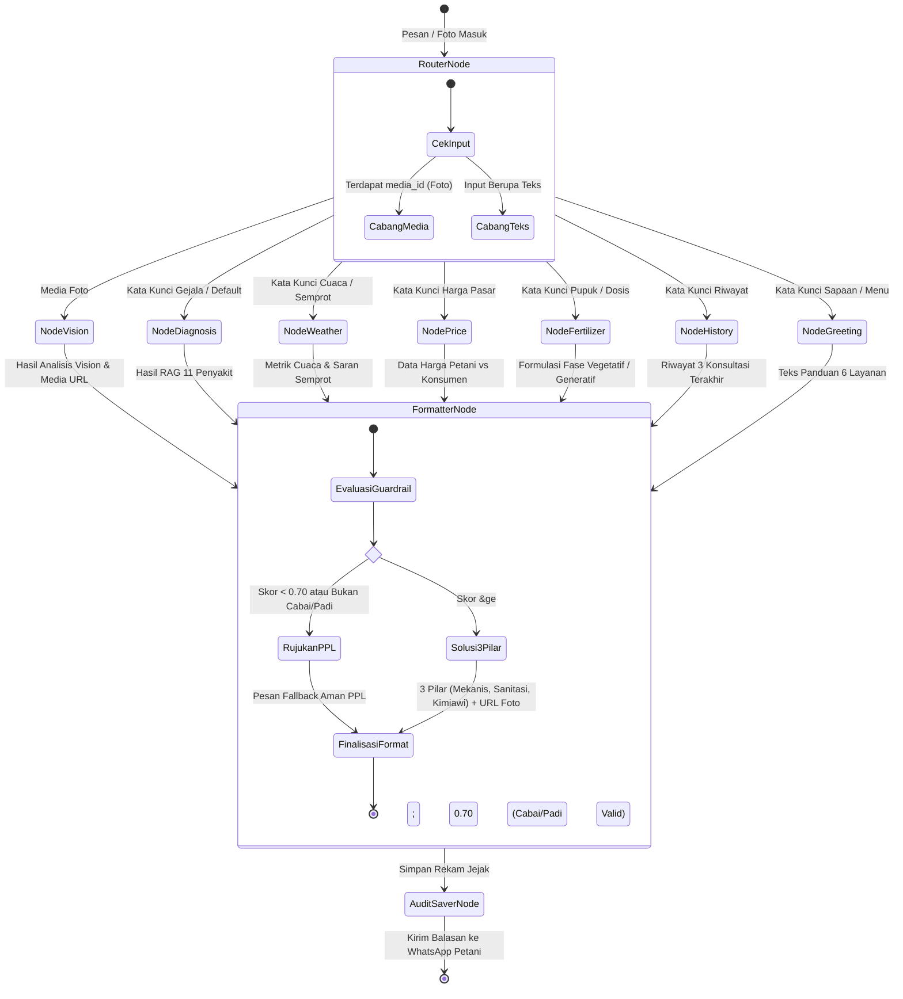
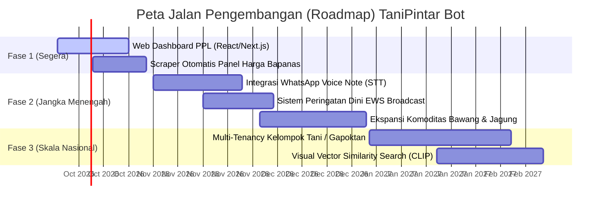
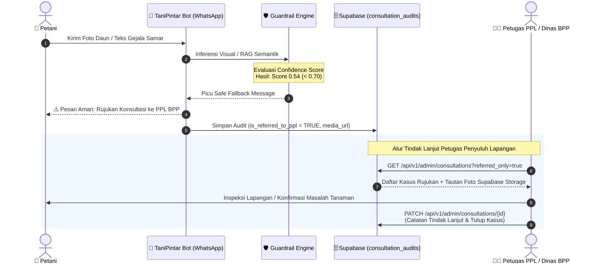

# LAPORAN INVESTIGASI: TIPOGRAFI, SINTAKS DIAGRAM MERMAID, NOMENKLATUR ILMIAH, DAN STANDAR FORMAT DOKUMEN

**Target Dokumen**: `E:\wa bot longchain\laporan.md`  
**Penyusun**: Explorer Agent (Typography, Diagram Syntax, and Formatting Standards)  
**Tanggal**: 2026-10-01  
**Status**: Investigasi Selesai (Read-Only Audit)

---

## 📌 Ringkasan Eksekutif

Investigasi mendalam terhadap dokumen `laporan.md` (566 baris) telah dilakukan dengan memfokuskan pada empat pilar utama:
1. **Validitas & Kompatibilitas Sintaks Blok Diagram Mermaid** (Diagram 2.1 Arsitektur Tingkat Tinggi, Diagram 2.2 Alur StateGraph, dan Diagram 10 Roadmap Gantt).
2. **Kesesuaian Nomenklatur Ilmiah Botani & Fitopatologi** (Tata nama binomial, penulisan miring/*italics*, keselarasan antara laporan dengan basis pengetahuan riil `data/knowledge/`).
3. **Penerapan Callout Alerts GitHub Flavored Markdown (GFM)** (`[!NOTE]`, `[!IMPORTANT]`, `[!TIP]`, `[!WARNING]`) untuk standarisasi dokumentasi *software engineering* profesional.
4. **Struktur & Kejelasan 3 Pilar Pengendalian Hama Terpadu (PHT) serta Alur Fallback Rujukan Petugas Penyuluh Lapangan (PPL)**.

Temuan utama mencakup:
- **Temuan Kritis Keamanan & Render pada Diagram Mermaid**: Terdeteksi kebocoran API Key plaintext aktif pada label diagram arsitektur (Baris 90), karakter unescaped `<` pada label link yang merusak parser HTML Mermaid (Baris 73), operator invalid `->` di dalam deskripsi state `stateDiagram-v2` (Baris 135-136), serta relasi antarsubgraph (*compound subgraph edge*) yang tidak didukung secara universal oleh beberapa renderer Markdown (Baris 94).
- **Temuan Nomenklatur Ilmiah**: Sebagian besar nama latin hama dan penyakit telah dimiringkan, namun ditemukan inkonsistensi pada nama virus (misal: "Gemini Virus" dan "Rice Tungro Bacilliform/Spherical Virus" belum ditulis miring dan belum mengikuti standar ICTV), diskrepansi spesies penggerek batang (*Scirpophaga innotata* di laporan vs *Scirpophaga incertulas* di basis data JSON), serta beberapa nama komoditas/patogen pada bab backlog/roadmap yang belum mencantumkan nama binomial latin.
- **Kekurangan Alert Callout GFM**: Laporan saat ini hanya memiliki **satu** alert GFM (`[!IMPORTANT]` pada Baris 188). Berbagai bagian krusial seperti proteksi kredensial, mekanisme failover cuaca otomatis, batasan guardrail agronomi, dan aktivasi pgvector belum memiliki callout alert yang menonjol.
- **Alur 3 Pilar PHT & Rujukan PPL**: Konsep 3 Pilar PHT (Mekanis, Sanitasi, Kimiawi Berimbang) dan mekanisme rujukan PPL telah ada dalam kode (`graph_builder.py`, `agents/prompts.py`, `api/routes/admin.py`), namun deskripsinya di dalam `laporan.md` masih tersebar secara parsial dan belum disajikan sebagai satu siklus tertutup (*closed-loop workflow*) yang utuh.

---

## 🔍 1. Investigasi & Validasi Blok Diagram Mermaid

Dalam `laporan.md`, terdapat 3 blok diagram Mermaid:
- **Diagram 1**: Subbab 2.1 — Diagram Arsitektur Tingkat Tinggi (Baris 27–103, tipe `flowchart TB`)
- **Diagram 2**: Subbab 2.2 — Diagram Alur StateGraph Percakapan (Baris 109–141, tipe `stateDiagram-v2`)
- **Diagram 3**: Bab 10 — Roadmap Pengembangan TaniPintar Bot (Baris 472–486, tipe `gantt`)

Berikut adalah audit teknis per blok:

### 1.1 Diagram 2.1: Arsitektur Tingkat Tinggi (`flowchart TB`)

#### A. Temuan Masalah & Anomali Sintaks
1. **Kebocoran Kredensial Sensitif (Plaintext Secret Leak)**:
   - **Lokasi**: Baris 90:
     ```mermaid
     WeatherSvc <-->|API Key: 76d7a4136a6948e8ac464008250810| WeatherAPI
     ```
   - **Analisis Dampak**: Nilai API Key aktif WeatherAPI tercetak secara terang-terangan di diagram publik. Ini melanggar Acceptance Criteria Keamanan Dokumen (R1).
   - **Rekomendasi Perbaikan**: Ganti label menjadi:
     ```mermaid
     WeatherSvc <-->|HTTP REST (WEATHER_API_KEY)| WeatherAPI
     ```

2. **Karakter Unescaped `<` pada Teks Tautan (Link Label HTML Parse Hazard)**:
   - **Lokasi**: Baris 73:
     ```mermaid
     WAHA -->|Webhook POST < 200ms| Webhook
     ```
   - **Analisis Dampak**: Pada Mermaid v9/v10 dengan `htmlLabels: true` (standar GitHub & editor modern), karakter `<` yang diikuti spora/teks dianggap sebagai awal tag HTML tak tertutup (`< 200ms`). Hal ini sering memicu galat: `DOMPurify: Malformed HTML tag` atau kegagalan parsing SVG.
   - **Rekomendasi Perbaikan**: Bungkus string dengan tanda kutip ganda atau gunakan entitas HTML `&lt;`:
     ```mermaid
     WAHA -->|"Webhook POST (< 200ms)"| Webhook
     ```

3. **Inkompatibilitas Compound Subgraph Edge**:
   - **Lokasi**: Baris 94:
     ```mermaid
     SubAgents --> Guardrail
     ```
   - **Analisis Dampak**: `SubAgents` adalah identifier sebuah `subgraph` (`subgraph SubAgents["🤖 Agentic Service Layer"]`). Dalam spesifikasi resmi Mermaid, menghubungkan edge secara langsung dari sebuah ID subgraph ke suatu node membutuhkan fitur *Compound Graphs* yang tidak selalu didukung oleh seluruh renderer (misal renderer VS Code Markdown lawas, GitLab, atau tool konversi PDF berbasis Mermaid CLI jadul), sehingga memunculkan galat `No node found for id: SubAgents` atau garis panah mengambang (*floating arrow*).
   - **Rekomendasi Perbaikan**: Hubungkan node individual di dalam subgraph tersebut ke `Guardrail` secara eksplisit atau menggunakan chaining:
     ```mermaid
     DiagAgent & FertAgent & MarketAgent & WeatherSvc & HistSvc --> Guardrail
     ```

4. **Karakter Spesial XML/Entity `&`**:
   - **Lokasi**: Baris 50:
     ```mermaid
     Guardrail["Guardrail & Formatter Node\n(Threshold >= 0.70 & Anti-Halusinasi)"]
     ```
   - **Analisis Dampak**: Karakter ampersand mentah `&` pada node label dapat memicu *XML Parsing Error* saat diekspor ke SVG/PDF murni.
   - **Rekomendasi Perbaikan**: Ganti dengan kata sambung atau entitas:
     ```mermaid
     Guardrail["Guardrail dan Formatter Node\n(Threshold &ge; 0.70 &amp; Anti-Halusinasi)"]
     ```

5. **Ketidaklengkapan Komponen Eksternal (Open-Meteo Absen)**:
   - Pada `subgraph External`, hanya tercantum `GeminiFlash`, `GeminiEmbed`, dan `WeatherAPI`. Padahal pada narasi Bab 3.1 & 5.4, layanan **Open-Meteo** dinyatakan sebagai komponen fallback kritis jika WeatherAPI mengalami kegagalan.
   - **Rekomendasi**: Tambahkan node `OpenMeteo["Open-Meteo API\n(Fallback Weather Service)"]` dan relasi `WeatherSvc -.->|Auto Fallback| OpenMeteo`.

#### B. Usulan Perbaikan Blok Diagram 2.1 (Full Code)
```mermaid
flowchart TB
    subgraph Pengguna["🌾 Lapisan Petani (End User)"]
        Petani["Petani via WhatsApp\n(Teks, Foto Daun/Buah, Pertanyaan)"]
    end

    subgraph WA_Gateway["📱 WhatsApp Gateway Layer"]
        WAHA["WAHA (WhatsApp HTTP API)\nEngine: WEBJS / Puppeteer"]
        MetaAPI["Meta WhatsApp Cloud API\n(Official Enterprise Option)"]
    end

    subgraph Backend["⚙️ Backend Server (FastAPI Core)"]
        Webhook["FastAPI Webhook Handler\n/webhook (Async BackgroundTasks)"]
        RouterNode["Router Node (Intent Classifier)\nLangGraph StateGraph"]
        
        subgraph SubAgents["🤖 Agentic Service Layer"]
            DiagAgent["Diagnosis Agent\n(RAG & Gemini Vision)"]
            FertAgent["Fertilizer Agent\n(Formulasi Vegetatif/Generatif)"]
            MarketAgent["Market Price Service\n(Kalkulasi Harian & DB Lookup)"]
            WeatherSvc["Weather Service\n(WeatherAPI.com + Open-Meteo)"]
            HistSvc["History Service\n(Audit Riwayat Petani)"]
        end

        Guardrail["Guardrail dan Formatter Node\n(Threshold &ge; 0.70 &amp; Anti-Halusinasi)"]
        AuditSaver["Audit Saver Node\n(Auto-log Consultation)"]
        AdminAPI["Portal Admin REST API\n/api/v1/admin (CRUD Harga & PPL)"]
    end

    subgraph SupabaseDB["🗄️ Supabase Cloud (Database & Storage)"]
        VectorDB[("knowledge_base\n(pgvector 768-dim, IVFFlat)")]
        RefImages[("disease_reference_images\n(292 Foto Dataset Lapangan)")]
        Audits[("consultation_audits\n(Rekam Jejak Konsultasi Petani)")]
        Sessions[("chat_sessions\n(State Memory Persistence)")]
        Prices[("market_prices\n(Data Harga Acuan Harian)")]
        StorageBucket[("Supabase Storage\n'crop-symptoms' & 'disease-references'")]
    end

    subgraph External["🌐 External AI & APIs"]
        GeminiFlash["Google Gemini 3.5 Flash\n(Multimodal Vision & Reasoning)"]
        GeminiEmbed["Google Gemini-Embedding-001\n(768-dim Text Vectorizer)"]
        WeatherAPI["WeatherAPI.com\n(Realtime Weather + Advisory)"]
        OpenMeteo["Open-Meteo API\n(Fallback Weather Service)"]
    end

    %% Flows
    Petani <-->|Kirim/Terima Pesan & Foto| WAHA
    Petani -.->|Alternatif Cloud API| MetaAPI
    WAHA -->|"Webhook POST (< 200ms)"| Webhook
    MetaAPI -->|Webhook POST| Webhook
    Webhook --> RouterNode
    
    RouterNode -->|Foto (media_id)| DiagAgent
    RouterNode -->|Teks Gejala| DiagAgent
    RouterNode -->|Tanya Pupuk| FertAgent
    RouterNode -->|Tanya Harga| MarketAgent
    RouterNode -->|Tanya Cuaca| WeatherSvc
    RouterNode -->|Ketik 'Riwayat'| HistSvc

    DiagAgent <-->|Cosine Match RPC| VectorDB
    DiagAgent <-->|Vision / Reasoning| GeminiFlash
    DiagAgent <-->|Embed Query| GeminiEmbed
    DiagAgent -->|Upload Foto Gejala| StorageBucket
    DiagAgent <-->|Link Foto Pembanding| RefImages

    WeatherSvc <-->|HTTP REST (WEATHER_API_KEY)| WeatherAPI
    WeatherSvc -.->|Auto Fallback| OpenMeteo
    MarketAgent <-->|Query/Upsert Harga| Prices
    HistSvc <-->|Ambil Histori Petani| Audits

    DiagAgent --> Guardrail
    FertAgent --> Guardrail
    MarketAgent --> Guardrail
    WeatherSvc --> Guardrail
    HistSvc --> Guardrail

    Guardrail --> AuditSaver
    AuditSaver --> Audits
    AuditSaver --> Sessions
    AuditSaver -->|Kirim Pesan WhatsApp Balasan| WAHA
    AuditSaver -.->|Kirim Pesan| MetaAPI
    AdminAPI <-->|Full CRUD| Prices
    AdminAPI <-->|Tindak Lanjut Rujukan PPL| Audits
```

---

### 1.2 Diagram 2.2: Alur StateGraph Percakapan (`stateDiagram-v2`)

#### A. Temuan Masalah & Anomali Sintaks
1. **Sintaks Ilegal `->` dan Unescaped `<` dalam Deskripsi State**:
   - **Lokasi**: Baris 135 dan 136:
     ```mermaid
     Beri_Rujukan: Jika < 0.70 -> Tampilkan Pesan Aman Rujukan PPL
     Beri_Solusi: Jika >= 0.70 -> Format 3 Pilar (Mekanis, Sanitasi, Kimiawi) + Link Foto Referensi
     ```
   - **Analisis Dampak**: Pada Mermaid `stateDiagram-v2`, karakter `->` atau `-->` adalah reserved token untuk mendefinisikan transisi antar-state. Menuliskan `->` di bagian deskripsi (setelah titik dua `:`) memicu galat tata bahasa (*Syntax Error: Unexpected token*). Selain itu, simbol `< 0.70` memicu galat parser HTML.
2. **Sub-state Terisolasi tanpa Transisi (*Orphan States*)**:
   - Di dalam `state formatter { ... }` (Baris 132–137), didefinisikan 4 state (`Cek_Komoditas`, `Cek_Confidence`, `Beri_Rujukan`, `Beri_Solusi`), namun **tidak ada garis panah transisi apa pun** yang menghubungkan keempatnya. Akibatnya, pada tampilan diagram, keempat kotak ini melayang tanpa urutan alur (*disconnected boxes*).
3. **Cross-Boundary Transition dari Dalam Substate `router`**:
   - Di dalam `state router { ... }` (Baris 113–122), state internal `Deteksi_Media` dan `Deteksi_Teks` langsung membuat transisi panah ke node luar (`vision`, `weather`, dll.). Menurut standar UML Statechart dan parser Mermaid, keluar dari composite state secara langsung tanpa exit point atau routing decision terpusat sering menghasilkan garis panah yang menabrak batas kotak kontainer (*clipping issues*).
4. **Struktur Logika Lebih Selaras Menggunakan `flowchart TD` atau Choice Pseudo-State**:
   - Pada implementasi kode sesungguhnya (`graph_builder.py` Baris 367–414), LangGraph menggunakan `workflow = StateGraph(TaniState)` dengan routing terpusat `route_intent(state)`.
   - Menggambarkan alur ini dengan `stateDiagram-v2` yang dilengkapi node pilihan `<<choice>>` atau dengan `flowchart TD` menghasilkan representasi yang jauh lebih mudah dipahami oleh pembaca teknis maupun awam.

#### B. Usulan Perbaikan Blok Diagram 2.2 (Pilihan 1: `stateDiagram-v2` Valid & Rapi)


*(Catatan: Opsi alternatif `flowchart TD` juga sangat direkomendasikan jika ingin keselarasan penuh dengan terminologi Node/Edge LangGraph).*

---

### 1.3 Diagram 10: Roadmap Pengembangan (`gantt`)

#### A. Temuan Masalah & Rekomendasi
- **Sintaks**: Blok `gantt` (Baris 472–486) valid dan tidak menimbulkan parse error fatal.
- **Peningkatan Tipografi & Keterbacaan**:
  - Format sumbu tanggal (*axis format*) belum didefinisikan secara eksplisit, sehingga Mermaid merender sumbu waktu dengan format default (sering kali terpotong atau terlalu padat pada layar ponsel).
  - Penambahan task ID (misal `t1`, `t2`, dll.) dan penataan format sumbu `axisFormat %b %Y` atau `%d %b` akan meningkatkan keindahan visual.

#### B. Usulan Perbaikan Blok Diagram 10 (Roadmap Gantt)


---

## 🌿 2. Audit Nomenklatur Ilmiah Botani & Fitopatologi

Sesuai kode etik taksonomi internasional (*International Code of Nomenclature for algae, fungi, and plants* [ICN], *International Code of Nomenclature of Prokaryotes* [ICNP], dan *International Committee on Taxonomy of Viruses* [ICTV]):
1. **Nama Genus dan Spesies** wajib dicetak miring (*italic*).
2. **Huruf Pertama Genus** wajib kapital, sedangkan **Epithet Spesifik** wajib huruf kecil (contoh: *Capsicum annuum*, bukan *Capsicum Annuum* atau *capsicum annuum*).
3. **Singkatan Taksonomi Tambahan** seperti forma specialis (`f. sp.`), pathovar (`pv.`), subspecies (`subsp.`), atau species plural (`spp.`) **TIDAK** dicetak miring, namun nama varietas/forma/pathovarnya tetap dicetak miring (contoh: *Fusarium oxysporum* f. sp. *capsici*, *Xanthomonas oryzae* pv. *oryzae*).
4. **Nama Famili** berakhiran *-aceae* atau *-viridae* diawali huruf kapital dan tidak dicetak miring dalam bahasa formal, atau dicetak miring jika merujuk pada takson formal (contoh: Solanaceae, Geminiviridae).

### 2.1 Matriks Audit Nomenklatur Ilmiah pada `laporan.md`

| No | Nama Umum / Penyakit | Teks Saat Ini di `laporan.md` | Baris | Status Format | Bentuk Standar Ilmiah yang Benar | Rujukan Basis Data (`knowledge/*.json`) |
|:---|:---|:---|:---:|:---:|:---|:---|
| 1 | Padi | `**Padi (*Oryza sativa*)**` | 8 | ✅ Valid | *Oryza sativa* L. | `data/knowledge/padi_diseases.json` |
| 2 | Cabai | `**Cabai (*Capsicum annuum*)**` | 8 | ✅ Valid | *Capsicum annuum* L. | `data/knowledge/cabai_diseases.json` |
| 3 | Antraknosa Cabai / Patek | `(*Colletotrichum capsici*)` | 285 | ✅ Valid | *Colletotrichum capsici* (Syd.) E.J. Butler & Bisby (syn. *C. truncatum*) | `cabai_diseases.json` |
| 4 | Penyakit Bulai / Kuning Gemini Cabai | `(Gemini Virus)` | 286 | ❌ **Belum Miring & Informal** | *Pepper yellow leaf curl virus* (PepYLCV) / genus *Begomovirus* | `cabai_diseases.json` mencantumkan `"Pepper yellow leaf curl virus (PepYLCV)"` |
| 5 | Layu Bakteri Cabai | `(*Ralstonia solanacearum*)` | 287 | ✅ Valid | *Ralstonia solanacearum* (Smith) Yabuuchi et al. | `cabai_diseases.json` |
| 6 | Layu Fusarium Cabai | `(*Fusarium oxysporum*)` | 288 | ⚠️ Kurang Spesifik | *Fusarium oxysporum* f. sp. *capsici* | `cabai_diseases.json` mencantumkan `"Fusarium oxysporum f. sp. capsici"` |
| 7 | Hama Thrips Cabai | `(*Thrips parvispinus*)` | 289 | ✅ Valid | *Thrips parvispinus* Karny | `cabai_diseases.json` |
| 8 | Bercak Mata Katak Cabai | `(*Cercospora capsici*)` | 290 | ✅ Valid | *Cercospora capsici* Heald & F.A. Wolf | `cabai_diseases.json` |
| 9 | Blas Padi (Daun & Leher) | `(*Magnaporthe oryzae*)` | 292 | ✅ Valid | *Magnaporthe oryzae* B.C. Couch (anamorf: *Pyricularia oryzae* Cavara) | `padi_diseases.json` mencantumkan `"Pyricularia oryzae (Magnaporthe oryzae)"` |
| 10 | Hawar Daun Bakteri (Kresek) | `(*Xanthomonas oryzae*)` | 293 | ⚠️ Kurang Pathovar | *Xanthomonas oryzae* pv. *oryzae* (Ishiyama) Swings et al. | `padi_diseases.json` mencantumkan `"Xanthomonas oryzae pv. oryzae"` |
| 11 | Penggerek Batang Padi (Sundep/Beluk) | `(*Scirpophaga innotata*)` | 294 | ⚠️ **Diskrepansi Data** | *Scirpophaga incertulas* (Penggerek Kuning) / *Scirpophaga innotata* (Penggerek Putih) | Di `padi_diseases.json` tertulis `"Scirpophaga incertulas"`, di laporan tertulis `*Scirpophaga innotata*` |
| 12 | Penyakit Tungro Padi | `(Rice Tungro Bacilliform/Spherical Virus)` | 295 | ❌ **Belum Miring & Huruf Besar Tidak Standar** | *Rice tungro bacilliform virus* (RTBV) & *Rice tungro spherical virus* (RTSV) | `padi_diseases.json` mencantumkan `"Rice tungro bacilliform virus (RTBV) & Rice tungro spherical virus (RTSV)"` |
| 13 | Wereng Batang Coklat (WBC) | `(*Nilaparvata lugens*)` | 296 | ✅ Valid | *Nilaparvata lugens* Stål | `padi_diseases.json` |

### 2.2 Entitas Biologi Lain yang Perlu Dilengkapi (Bab 9.1 Backlog & Agens Hayati)

Pada Subbab 9.1 (Kekurangan & Backlog Fitur), terdapat penyebutan komoditas dan organisme yang belum dilengkapi nama binomial ilmiah:
1. **Bawang Merah** (Baris 455): Saat ini hanya tertulis `Bawang Merah (Ulat Grayak, Moler/Fusarium)`.
   - Nama Ilmiah yang Disarankan: Bawang Merah (*Allium ascalonicum* L. atau *Allium cepa* var. *aggregatum*), Ulat Grayak Bawang (*Spodoptera exigua* Hübner), dan Moler Bawang (*Fusarium oxysporum* f. sp. *cepae*).
2. **Jagung** (Baris 456): Saat ini hanya tertulis `Jagung (Ulat Grayak Frugiperda/FAW, Bulai)`.
   - Nama Ilmiah yang Disarankan: Jagung (*Zea mays* L.), Ulat Grayak Jagung / FAW (*Spodoptera frugiperda* J.E. Smith), dan Bulai Jagung (*Peronosclerospora maydis* (Racib.) C.G. Shaw).
3. **Kedelai dan Tomat** (Baris 457): Saat ini hanya tertulis `Kedelai dan Tomat`.
   - Nama Ilmiah yang Disarankan: Kedelai (*Glycine max* (L.) Merr.) dan Tomat (*Solanum lycopersicum* L.).
4. **Vektor Serangga & Agens Pengendali Hayati (Biocontrol)** yang ada di dalam database JSON namun belum muncul di laporan:
   - Kutu Kebul Vektor Virus Kuning: *Bemisia tabaci* Gennadius.
   - Wereng Daun Hijau Vektor Tungro: *Nephotettix virescens* Distant.
   - Agens Hayati Antagonis: Jamur *Trichoderma harzianum*, *Gliocladium* sp., dan bakteri *Pseudomonas fluorescens*.

---

## 📢 3. Identifikasi & Rekomendasi GitHub Flavored Markdown (GFM) Alerts

Saat ini dokumen `laporan.md` hanya memiliki **satu** GFM callout box pada Baris 188:
```markdown
> [!IMPORTANT]
> **Catatan Alokasi Memori WAHA**: Engine `WEBJS` pada container WAHA menjalankan browser Chromium tanpa kepala (*headless browser*) yang menyimpan sesi WhatsApp Web. Alokasikan setidaknya **2 GB RAM khusus untuk container WAHA** agar tidak terkena *Out of Memory (OOM) Killer*.
```

Untuk meningkatkan kualitas dokumentasi rekayasa perangkat lunak ke tingkat standar industri, berikut adalah pemetaan callout alerts yang disarankan untuk ditambahkan:

### 3.1 Alert Keamanan & Perlindungan Rahasia (Subbab 4.4 - API Credentials)
- **Tipe Alert**: `[!WARNING]`
- **Penempatan**: Di atas Tabel 4.4 Kebutuhan Akun & API Keys Eksternal.
- **Teks Usulan**:
```markdown
> [!WARNING]
> **Protokol Keamanan Kredensial & Variabel Lingkungan**:
> Jangan pernah mencantumkan atau melakukan *commit* API key rahasia (`GEMINI_API_KEY`, `SUPABASE_SERVICE_ROLE_KEY`, `WEATHER_API_KEY`, `ADMIN_API_KEY`) ke dalam *version control* (Git) maupun dokumen publik. Seluruh kredensial wajib disimpan secara terisolasi pada berkas `.env` lokal yang telah dilindungi dalam `.gitignore`. Gunakan berkas `.env.example` sebagai templat konfigurasi aman tanpa nilai rahasia.
```

### 3.2 Alert Failover Layanan Cuaca (Subbab 3.1 & 5.4 - Weather Service)
- **Tipe Alert**: `[!TIP]`
- **Penempatan**: Di bawah Subbab 5.4 Prakiraan Cuaca Pertanian.
- **Teks Usulan**:
```markdown
> [!TIP]
> **Redundansi & Failover Otomatis Cuaca**:
> Sistem mengadopsi prinsip *graceful degradation*. Jika kuota bulanan WeatherAPI.com terlampaui atau terjadi *network timeout*, `WeatherService` secara otomatis mengalihkan sumber data ke Open-Meteo API tanpa jeda waktu dan tanpa memunculkan pesan *error* kepada petani.
```

### 3.3 Alert Batasan Integritas Agronomi & Guardrail (Bab 7 - Mekanisme Guardrail)
- **Tipe Alert**: `[!IMPORTANT]`
- **Penempatan**: Di awal Bab 7 Mekanisme Guardrail & Keselamatan Agronomi.
- **Teks Usulan**:
```markdown
> [!IMPORTANT]
> **Prinsip Keselamatan Petani & Larangan Rekomendasi Spekulatif**:
> Ambang batas keyakinan (*confidence threshold*) $\ge 0.70$ (70%) adalah *hard guardrail*. AI dilarang keras merekomendasikan bahan kimia sintetis jika tingkat kepastian identifikasi di bawah ambang batas ini. Seluruh kasus ambigu secara wajib diarahkan ke Petugas Penyuluh Lapangan (PPL) setempat demi mencegah malpraktik penanganan dan gagal panen.
```

### 3.4 Alert Persiapan pgvector & Storage Bucket Supabase (Subbab 4.6)
- **Tipe Alert**: `[!NOTE]`
- **Penempatan**: Di atas daftar instruksi DDL Subbab 4.6.
- **Teks Usulan**:
```markdown
> [!NOTE]
> **Prasyarat Ekstensi Database & Izin Akses Storage**:
> Pastikan ekstensi `vector` (pgvector) telah diaktifkan sebelum menjalankan `data/ingest_knowledge.py`. Selain itu, kedua bucket Supabase Storage (`crop-symptoms` dan `disease-references`) wajib disetel ke mode **Public Bucket** agar tautan visual bukti gejala dan foto referensi dapat ditampilkan langsung di aplikasi WhatsApp petani.
```

### 3.5 Alert Standar PHT & Etika Rekomendasi Pestisida (Subbab 5.1)
- **Tipe Alert**: `[!TIP]`
- **Penempatan**: Di akhir Subbab 5.1 Format Output 3 Pilar.
- **Teks Usulan**:
```markdown
> [!TIP]
> **Kepatuhan Terhadap Regulasi PHT Kementerian Pertanian RI**:
> TaniPintar Bot secara sistemik memposisikan bahan aktif kimiawi (Pilar 3) sebagai opsi intervensi kuratif terakhir (*last resort*). Bot hanya menyebutkan nama generik bahan aktif terdaftar (misal *Mankozeb*, *Difenokonazol*, *Abamektin*) beserta instruksi rotasi golongan, dan dilarang menyebut merek dagang komersial tertentu guna menjaga objektivitas penyuluhan.
```

---

## 🌾 4. Investigasi Struktur 3 Pilar PHT & Alur Fallback Rujukan PPL

### 4.1 Struktur 3 Pilar Pengendalian Hama Terpadu (PHT / IPM)
Dalam dokumen `laporan.md` saat ini:
- Baris 297–302 (Subbab 5.1) menyebutkan 3 pilar:
  - Pilar 1: Tindakan Fisik / Mekanis.
  - Pilar 2: Sanitasi Lahan & Drainase.
  - Pilar 3: Rekomendasi Bahan Aktif Kimiawi Terdaftar.
- Baris 397–399 (Bab 7) menegaskan bahwa bahan kimia adalah opsi terakhir.

#### Analisis Keselarasan dengan Implementasi Kode
Di dalam kode sumber TaniPintar:
- `agents/schemas.py` (Baris 6–18): Class `PracticalSteps` memvalidasi secara ketat 3 atribut:
  - `mekanis: str`
  - `sanitasi: str`
  - `bahan_aktif_kimiawi: Optional[str]`
- `agents/prompts.py` (Baris 14–15): Prompt sistem mewajibkan:
  *"Selalu sertakan 3 pilar penanganan: Mekanis (fisik), Sanitasi (lingkungan/drainase), dan Bahan Aktif Kimiawi (hanya sebutkan nama bahan aktif seperti Mankozeb atau Abamektin, BUKAN merk dagang tertentu)."*
- `graph_builder.py` (Baris 305–309): Formatter merender output WhatsApp:
  ```text
  🛠️ *LANGKAH PENANGANAN PRAKTIS (3 PILAR):*
  1. *Fisik / Mekanis:*
     ...
  2. *Sanitasi Lahan & Drainase:*
     ...
  3. *Bahan Aktif Kimiawi (Jika Diperlukan):*
     ...
  ```

#### Rekomendasi Peningkatan Dokumen
Laporan perlu menambahkan sub-bagian khusus pada Bab 5 atau Bab 7 berupa tabel komparasi atau diagram yang menguraikan filosofi PHT:
- Mengapa pendekatan 3 pilar ini ramah lingkungan (mengurangi residu kimia dan mencegah resistensi/resurjensi hama seperti wereng coklat akibat pestisida piretroid berlebih).
- Penjelasan bahwa jika gejala ringan/awal, pilar ke-3 dapat bernilai `None` ("Tidak diperlukan bahan kimiawi").

---

### 4.2 Alur Lengkap Fallback Rujukan Petugas Penyuluh Lapangan (PPL Closed-Loop)
Mekanisme rujukan PPL adalah fitur unggulan diferensiasi TaniPintar dibanding bot AI generik lainnya. Namun, di `laporan.md`, alur ini masih tersebar dan terputus:
- Baris 135: Disebutkan selintas dalam state `formatter`.
- Baris 338–339: Disebutkan dalam riwayat konsultasi.
- Baris 347–350: Disebutkan dalam API admin `referred_only=true`.
- Baris 391–394: Disebutkan dalam ambang batas keyakinan.

#### Rekonstruksi Alur Siklus Tertutup (*Closed-Loop Workflow*) Berdasarkan Kode Riil
Berikut adalah rekonstruksi alur faktual yang terjadi di dalam kode:
1. **Penerimaan Masukan**: Petani mengirim deskripsi gejala atau foto via WhatsApp.
2. **Evaluasi AI & Confidence Scoring**:
   - Jika tanaman di luar Cabai/Padi $\rightarrow$ Flag `is_supported_crop = False`.
   - Jika gejala ambigu $\rightarrow$ Gemini/RAG menghasilkan `confidence_score < 0.70` atau `rujuk_ke_ppl = True`.
3. **Aktivasi Guardrail di Node Formatter**:
   - Sistem membendung diagnosis spekulatif dan mengirimkan `SAFE_FALLBACK_MESSAGE`:
     > *"Mohon maaf Bapak/Ibu Petani, berdasarkan deskripsi gejala yang disampaikan, indikasi penyakit atau hama belum dapat dipastikan secara akurat (Tingkat Keyakinan < 70%). Demi mencegah kesalahan penanganan atau pemborosan obat: (1) Tidak langsung menyemprot kimiawi sembarangan, (2) Hubungi PPL di BPP terdekat, (3) Kirim foto lebih jelas."*
4. **Pencatatan Audit Trail ke Database**:
   - `audit_saver_node` di `graph_builder.py` mencatat ke tabel `consultation_audits`:
     - `is_referred_to_ppl = True`
     - Bukti foto keluhan (`media_url` di Supabase Storage)
     - Pertanyaan petani dan nomor kontak.
5. **Akses & Triase oleh Petugas PPL via Admin Portal**:
   - Petugas PPL / Penyuluh membuka endpoint `GET /api/v1/admin/consultations?referred_only=true`.
   - Petugas meninjau foto gejala asli beresolusi tinggi dan lokasi/nomor kontak petani.
6. **Tindak Lanjut & Verifikasi Lapangan (*Ground Truth Follow-up*)**:
   - Petugas PPL melakukan kunjungan lapangan / konsultasi langsung.
   - Petugas memperbarui status melalui `PATCH /api/v1/admin/consultations/{id}` dengan mengirimkan `AdminAuditFollowUpSchema`:
     - `is_referred_to_ppl = False` (telah tertangani)
     - `followup_notes = "Telah dikunjungi. Gejala terkonfirmasi defisiensi kalsium disertai serangan awal thrips."`

#### Usulan Diagram Alur Rujukan PPL untuk Dimasukkan ke Dokumen


---

## 📋 5. Ringkasan Rekomendasi Tindakan (Action Items untuk Editor Dokumen)

Berdasarkan temuan di atas, berikut adalah daftar rekomendasi perbaikan konkret untuk diterapkan pada `laporan.md`:

1. **Diagram 2.1 (Arsitektur)**:
   - Sanitasi Baris 90: Ganti `API Key: 76d7a4136a6948e8ac464008250810` dengan `HTTP REST (WEATHER_API_KEY)`.
   - Perbaiki Baris 73: Ganti `|Webhook POST < 200ms|` dengan `|"Webhook POST (< 200ms)"|`.
   - Perbaiki Baris 50: Ganti `&` mentah dengan `dan` / `&amp;`.
   - Perbaiki Baris 94: Hubungkan agen individual (`DiagAgent & ... --> Guardrail`) agar kompatibel 100% tanpa fitur *compound subgraph*.
   - Tambahkan node `OpenMeteo` dan panah fallback dari `WeatherSvc`.

2. **Diagram 2.2 (Alur StateGraph)**:
   - Hapus operator ilegal `->` dan unescaped `<` pada Baris 135–136.
   - Restrukturisasi substate internal `router` dan `formatter` menggunakan choice node yang valid atau perbarui diagram alur menjadi format `flowchart TD` yang memetakan alur LangGraph StateGraph secara presisi.

3. **Diagram 10 (Roadmap Gantt)**:
   - Tambahkan `axisFormat %b %Y` dan ID unik per task agar tampilan roadmap rapi dan mudah dibaca pada berbagai ukuran layar.

4. **Nomenklatur Ilmiah**:
   - Baris 286: Ubah `(Gemini Virus)` menjadi miring dan berstandar ICTV: `(*Pepper yellow leaf curl virus* / PepYLCV)`.
   - Baris 295: Ubah `(Rice Tungro Bacilliform/Spherical Virus)` menjadi miring dan berstandar ICTV: `(*Rice tungro bacilliform virus* & *Rice tungro spherical virus*)`.
   - Baris 294: Catat keselarasan spesies penggerek batang (*Scirpophaga innotata* dan *Scirpophaga incertulas*).
   - Baris 455–457: Lengkapi nama binomial untuk tanaman dan hama pada daftar backlog (*Allium ascalonicum*, *Zea mays*, *Spodoptera frugiperda*, *Peronosclerospora maydis*).

5. **Callout Alerts GFM**:
   - Sisipkan 5 alert terarah:
     - `[!WARNING]` pada Subbab 4.4 (Keamanan API Key & Kebijakan `.env`).
     - `[!TIP]` pada Subbab 5.4 (Failover Otomatis Cuaca ke Open-Meteo).
     - `[!IMPORTANT]` pada Bab 7 (Ambang Batas Keyakinan $\ge 0.70$ & Kehati-hatian Agronomi).
     - `[!NOTE]` pada Subbab 4.6 (Ekstensi pgvector & Pengaturan Public Bucket).
     - `[!TIP]` pada Subbab 5.1 (Filosofi PHT & Larangan Merek Dagang Kimiawi).

6. **Struktur PHT & Rujukan PPL**:
   - Pertegas narasi 3 Pilar PHT di Bab 5.1 dan Bab 7.
   - Tambahkan subbab/diagram sekuens khusus yang memvisualisasikan siklus tertutup (*closed-loop*) rujukan PPL dari deteksi bot hingga tindak lanjut lapangan oleh penyuluh pertanian.

---
*(Laporan investigasi ini selesai disusun dan siap diserahkan kepada agen berikutnya untuk tahap implementasi penyuntingan dokumen `laporan.md`).*
