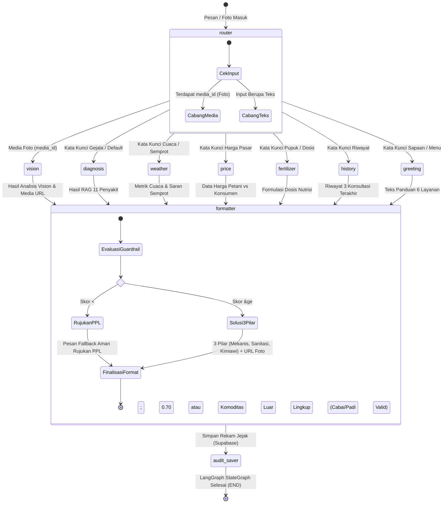
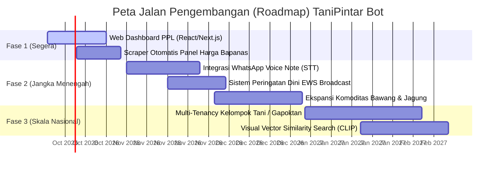

# 📑 LAPORAN LENGKAP SISTEM & ARSITEKTUR: TANIPINTAR BOT
**WhatsApp AI Agricultural Support Agent with RAG, Multimodal Vision, and Memory**

---

## 📌 1. Ringkasan Eksekutif Proyek

**TaniPintar Bot** adalah sistem asisten virtual berbasis kecerdasan buatan (*Artificial Intelligence*) yang beroperasi melalui platform **WhatsApp** (didukung oleh WAHA WebJS dan Meta WhatsApp Cloud API). Sistem ini dirancang untuk mendemokratisasi akses konsultasi agronomi bagi petani Indonesia, dengan fokus utama pada dua komoditas pangan paling strategis: **Padi (*Oryza sativa*)** dan **Cabai (*Capsicum annuum*)**.

Sistem menggabungkan pendekatan **Retrieval-Augmented Generation (RAG)** semantik dengan basis data vektor (*pgvector*), analisis citra visual multimodal (**Google Gemini 3.5 Flash Vision**), mesin alur percakapan (**LangGraph StateGraph**), prakiraan cuaca pertanian real-time (**WeatherAPI.com & Open-Meteo**), transparansi harga pasar komoditas, serta portal administrasi untuk Petugas Penyuluh Lapangan (PPL).

### Status Implementasi Saat Ini
- **Status Sistem**: *Fully Functional MVP / Production-Ready Core*.
- **Cakupan Pengetahuan**: 11 Penyakit & Hama Utama (6 Cabai, 5 Padi) terindeks 768 dimensi di Supabase pgvector.
- **Koleksi Dataset Visual**: 292 foto referensi terverifikasi yang tersimpan di Supabase Storage (`disease-references`) dan terhubung otomatis pada hasil diagnosa bot.
- **Konektivitas WhatsApp**: Berjalan secara live menggunakan WAHA engine `WEBJS` terhubung ke nomor bot WhatsApp operasional (`+62 895-4181-XXXX` / terdaftar pada sesi WAHA).
- **Kualitas Kode & Pengujian**: 13/13 automated test suites lolos (100% pass).

---

## 🏗️ 2. Arsitektur Sistem (System Architecture)

Arsitektur TaniPintar dibangun mengacu pada prinsip *Separation of Concerns* (Pemisahan Tanggung Jawab) antara lapisan presentasi (*WhatsApp Gateway*), orkestrasi alur (*LangGraph State Machine*), logika bisnis agronomi (*PydanticAI Agents*), basis data vektor & relasional (*Supabase PostgreSQL*), serta integrasi pihak ketiga (*WeatherAPI, Gemini API*).

### 2.1 Diagram Arsitektur Tingkat Tinggi (High-Level Architecture)

```mermaid
flowchart TB
    subgraph Pengguna["🌾 Lapisan Petani (End User)"]
        Petani["Petani via WhatsApp\n(Teks, Foto Daun/Buah, Pertanyaan)"]
    end

    subgraph WA_Gateway["📱 WhatsApp Gateway Layer"]
        WAHA["WAHA (WhatsApp HTTP API)\nEngine: WEBJS / Puppeteer"]
        MetaAPI["Meta WhatsApp Cloud API\n(Official Enterprise Option)"]
    end

    subgraph Backend["⚙️ Backend Server (FastAPI Core)"]
        Webhook["FastAPI Webhook Handler\n/webhook (Async BackgroundTasks)"]
        RouterNode["Router Node (Intent Classifier)\nLangGraph StateGraph"]
        
        subgraph SubAgents["🤖 Agentic Service Layer"]
            DiagAgent["Diagnosis Agent\n(RAG & Gemini Vision)"]
            FertAgent["Fertilizer Agent\n(Formulasi Vegetatif/Generatif)"]
            MarketAgent["Market Price Service\n(Kalkulasi Harian & DB Lookup)"]
            WeatherSvc["Weather Service\n(WeatherAPI.com + Open-Meteo)"]
            HistSvc["History Service\n(Audit Riwayat Petani)"]
        end

        Guardrail["Guardrail dan Formatter Node\n(Threshold &ge; 0.70 &amp; Anti-Halusinasi)"]
        AuditSaver["Audit Saver Node\n(Auto-log Consultation)"]
        AdminAPI["Portal Admin REST API\n/api/v1/admin (CRUD Harga & PPL)"]
    end

    subgraph SupabaseDB["🗄️ Supabase Cloud (Database & Storage)"]
        VectorDB[("knowledge_base\n(pgvector 768-dim, IVFFlat)")]
        RefImages[("disease_reference_images\n(292 Foto Dataset Lapangan)")]
        Audits[("consultation_audits\n(Rekam Jejak Konsultasi Petani)")]
        Sessions[("chat_sessions\n(State Memory Persistence)")]
        Prices[("market_prices\n(Data Harga Acuan Harian)")]
        StorageBucket[("Supabase Storage\n'crop-symptoms' & 'disease-references'")]
    end

    subgraph External["🌐 External AI & APIs"]
        GeminiFlash["Google Gemini 3.5 Flash\n(Multimodal Vision & Reasoning)"]
        GeminiEmbed["Google Gemini-Embedding-001\n(768-dim Text Vectorizer)"]
        WeatherAPI["WeatherAPI.com\n(Realtime Weather + Advisory)"]
        OpenMeteo["Open-Meteo API\n(Fallback Weather Service)"]
    end

    %% Flows
    Petani <-->|Kirim/Terima Pesan & Foto| WAHA
    Petani -.->|Alternatif Cloud API| MetaAPI
    WAHA -->|"Webhook POST (&lt; 200ms)"| Webhook
    MetaAPI -->|Webhook POST| Webhook
    Webhook --> RouterNode
    
    RouterNode -->|Foto (media_id)| DiagAgent
    RouterNode -->|Teks Gejala| DiagAgent
    RouterNode -->|Tanya Pupuk| FertAgent
    RouterNode -->|Tanya Harga| MarketAgent
    RouterNode -->|Tanya Cuaca| WeatherSvc
    RouterNode -->|Ketik 'Riwayat'| HistSvc

    DiagAgent <-->|Cosine Match RPC| VectorDB
    DiagAgent <-->|Vision / Reasoning| GeminiFlash
    DiagAgent <-->|Embed Query| GeminiEmbed
    DiagAgent -->|Upload Foto Gejala| StorageBucket
    DiagAgent <-->|Link Foto Pembanding| RefImages

    WeatherSvc <-->|HTTP REST (WEATHER_API_KEY)| WeatherAPI
    WeatherSvc -.->|Auto Fallback| OpenMeteo
    MarketAgent <-->|Query/Upsert Harga| Prices
    HistSvc <-->|Ambil Histori Petani| Audits

    DiagAgent & FertAgent & MarketAgent & WeatherSvc & HistSvc --> Guardrail
    Guardrail --> AuditSaver
    AuditSaver --> Audits
    AuditSaver --> Sessions
    Webhook -.->|Async BackgroundTasks Dispatch| WAHA
    Webhook -.->|Async BackgroundTasks Dispatch| MetaAPI

    AdminAPI <-->|Full CRUD| Prices
    AdminAPI <-->|Tindak Lanjut Rujukan PPL| Audits
```

> [!NOTE]
> **Pemisahan Jalur Eksekusi Graf dan Pengiriman Pesan**:
> Di dalam graf LangGraph (`graph_builder.py`), node `audit_saver` hanya bertugas menulis log audit dan konteks percakapan ke Supabase, kemudian bertransisi langsung ke terminal node `END`. Pengiriman pesan balasan ke WhatsApp petani tidak dilakukan oleh `audit_saver`, melainkan ditangani secara asinkron oleh fungsi background task `process_incoming_message` pada lapisan handler FastAPI (`api/routes/whatsapp.py`). Pendekatan ini memastikan webhook langsung membalas HTTP 200 OK ke gateway WAHA/Meta dalam waktu `< 200ms` guna mencegah *timeout*.

---

### 2.2 Diagram Alur StateGraph Percakapan (LangGraph Workflow)



> [!NOTE]
> **Struktur Topologi LangGraph**:
> Node `router` (`router_node`) merupakan simpul tunggal (*single node*) yang mengklasifikasikan intensi pengguna ke dalam variabel status `intent`. Fungsi `route_intent(state)` mengevaluasi nilai tersebut melalui *conditional edge* untuk mengarahkan alur ke salah satu dari 7 simpul spesialis (*worker nodes*). Seluruh hasil kemudian dikonsolidasikan oleh `formatter` (`format_and_guardrail_node`) sebelum diteruskan ke `audit_saver` (`audit_saver_node`) dan berakhir di terminal graf `END`.

---

## 💻 3. Spesifikasi Teknologi (Technology Stack)

Sistem TaniPintar dibangun menggunakan ekosistem teknologi modern berbasis Python asinkron, LLM multimodal mutakhir, dan infrastruktur cloud yang tangguh:

### 3.1 Ringkasan Komponen Tech Stack

| Layer / Kategori | Komponen / Pustaka | Versi | Peran & Fungsi dalam Sistem |
| :--- | :--- | :--- | :--- |
| **Bahasa & Runtime** | **Python** | `3.12` / `3.10+` | Bahasa pemrograman utama untuk backend, AI, dan data pipeline. |
| **Backend & Web Framework** | **FastAPI** | `>=0.115.0` | Framework web REST API asynchronous berkecepatan tinggi untuk webhook WhatsApp dan portal admin. |
| **Web Server (ASGI)** | **Uvicorn [standard]** | `>=0.30.0` | ASGI HTTP server untuk menjalankan FastAPI secara asinkron dengan fitur auto-reload. |
| **Validasi & Konfigurasi** | **Pydantic & Pydantic-Settings** | `>=2.8.0` / `>=2.4.0` | Validasi tipe data ketat, serialisasi skema agronomi, dan pemuatan variabel lingkungan (.env). |
| **Orkestrator Alur (Agentic)** | **LangGraph** | `>=0.2.20` | Mesin StateGraph untuk navigasi intent percakapan, cyclical state management, dan conditional routing. |
| **Framework LLM & Abstraksi** | **PydanticAI & LangChain Core** | `>=0.0.18` / `>=0.3.0` | Framework agen cerdas untuk penegakan Structured Output JSON dan penanganan fallback model. |
| **Model AI Vision & Teks** | **Google Gemini 3.5 Flash** | API 2026 / latest | Model multimodal untuk inspeksi visual foto penyakit tanaman dan penalaran agronomi. |
| **Model Embedding Teks** | **Google Gemini-Embedding-001** | `output_dim: 768` | Vektorisasi semantik dokumen pengetahuan 11 penyakit dan kueri pertanyaan petani. |
| **SDK Google GenAI** | **google-genai & langchain-google-genai** | `>=0.1.1` / `>=2.0.0` | Driver resmi Google untuk integrasi LLM dan Text Embedding API. |
| **Basis Data Relasional & Vektor**| **Supabase Cloud (PostgreSQL 15+)** | Cloud Hosted | Database relasional untuk sesi chat, audit PPL, harga pasar, dan katalog foto dataset. |
| **Pencarian Semantik (Vector)** | **pgvector** (Postgres Extension) | Enabled | Penyimpanan vektor 768 dimensi dan kalkulasi kemiripan kosinus dengan indeks `IVFFlat`. |
| **SDK Supabase** | **supabase (Python Client)** | `>=2.6.0` | Client resmi Python untuk query PostgREST, RPC `match_knowledge`, dan interaksi Storage API. |
| **Penyimpanan Berkas (Storage)** | **Supabase Storage** | Public Buckets | Bucket `crop-symptoms` (foto keluhan petani) dan `disease-references` (292 foto dataset). |
| **Klien HTTP Asinkron** | **HTTPX** | `>=0.27.0` | Klien HTTP non-blocking untuk unduh media foto WhatsApp, query WeatherAPI, dan Open-Meteo. |
| **Gateway WhatsApp (Self-Hosted)** | **WAHA (WhatsApp HTTP API)** | Docker `devlikeapro/waha` | Gateway WhatsApp berbasis browser Chromium headless (WebJS engine) tanpa biaya per pesan. |
| **Gateway WhatsApp (Resmi)** | **Meta WhatsApp Cloud Graph API** | `v20.0` | Alternatif resmi WhatsApp Business Enterprise melalui Webhook Meta Graph API. |
| **Layanan Cuaca Utama** | **WeatherAPI.com** | REST API | Penyedia data cuaca real-time, presipitasi, kelembapan, dan peluang hujan per kota di Indonesia. |
| **Layanan Cuaca Fallback** | **Open-Meteo API** | Free REST API | Fallback otomatis tanpa kuota untuk koordinat dan prakiraan cuaca sentra pertanian Indonesia. |
| **Kontainerisasi & DevOps** | **Docker & Docker Compose** | Docker v24+ | Pembungkus container untuk mengisolasi aplikasi `tanipintar-bot` dan gateway `waha`. |

---

## ⚙️ 4. Kebutuhan Sistem (System Requirements)

Berikut adalah rincian prasyarat teknis perangkat keras (*hardware*), sistem operasi, dependensi paket, dan kunci API eksternal yang dibutuhkan untuk menjalankan sistem TaniPintar:

### 4.1 Kebutuhan Perangkat Keras (Hardware Requirements)

| Komponen Perangkat Keras | Spesifikasi Minimum (Development) | Spesifikasi Rekomendasi (Production VPS) |
| :--- | :--- | :--- |
| **Processor (CPU)** | 2 Core CPU (x86_64 atau ARM64) | 4 vCPU Core (2.4 GHz+) |
| **Memori (RAM)** | 4 GB RAM *(WAHA WebJS membutuhkan minimal 1.5 GB untuk Chromium)* | 8 GB RAM *(Direkomendasikan agar browser headless lancar)* |
| **Penyimpanan (Disk Storage)**| 20 GB SSD kosong | 40 GB SSD NVMe |
| **Koneksi Jaringan (Network)** | Akses internet stabil (Unduh/Unggah $\ge$ 10 Mbps) | Bandwidth 100 Mbps+, IP Publik statis, Latensi rendah ke Supabase |

> [!IMPORTANT]
> **Catatan Alokasi Memori WAHA**: Engine `WEBJS` pada container WAHA menjalankan browser Chromium tanpa kepala (*headless browser*) yang menyimpan sesi WhatsApp Web. Alokasikan setidaknya **2 GB RAM khusus untuk container WAHA** agar tidak terkena *Out of Memory (OOM) Killer*.

---

### 4.2 Kebutuhan Perangkat Lunak & Sistem Operasi (Software & OS Requirements)

1. **Sistem Operasi**:
   - **Linux**: Ubuntu 22.04 LTS / 24.04 LTS atau Debian 12 (Sangat direkomendasikan untuk produksi).
   - **Windows**: Windows 10/11 64-bit dengan WSL2 (Windows Subsystem for Linux) atau PowerShell 7+.
   - **macOS**: macOS Monterey 12+ (Apple Silicon atau Intel).
2. **Container Engine**:
   - **Docker Engine**: Versi `24.0.0` atau yang lebih baru.
   - **Docker Compose**: Versi `v2.20.0` atau yang lebih baru.
3. **Runtime Python (Jika Menjalankan Bare-Metal / Local Virtualenv)**:
   - Python versi `3.10`, `3.11`, atau `3.12` (Direkomendasikan `3.12-slim` seperti pada Dockerfile).
   - Package manager: `uv` (sangat cepat) atau `pip` standar.
4. **Git**: Versi `2.34+` untuk manajemen versi kode sumber.

---

### 4.3 Kebutuhan Pustaka & Dependensi Python (`requirements.txt`)

Seluruh paket Python berikut didefinisikan dalam `requirements.txt` dan `pyproject.toml`:

```text
fastapi>=0.115.0              # Framework Web REST API & Webhook Handler
uvicorn[standard]>=0.30.0     # Server ASGI berperforma tinggi
pydantic>=2.8.0               # Validasi data & schema parsing
pydantic-settings>=2.4.0      # Pengelolaan konfigurasi environment terisolasi
pydantic-ai>=0.0.18           # Abstraksi agen LLM berbasis structured output
langgraph>=0.2.20             # State machine & routing graph multi-agent
langchain-core>=0.3.0         # Komponen dasar LangChain
langchain-google-genai>=2.0.0 # Integrasi model Gemini dalam LangChain
google-genai>=0.1.1           # SDK resmi Google GenAI API (Gemini 3.5 & Embeddings)
supabase>=2.6.0               # Client Python Supabase (PostgREST, Auth, Storage)
httpx>=0.27.0                 # HTTP client asynchronous non-blocking
python-dotenv>=1.0.1          # Pembaca berkas konfigurasi .env lokal
python-multipart>=0.0.9       # Parser form data & file upload untuk FastAPI
```

---

### 4.4 Kebutuhan Akun & API Keys Eksternal (API Credentials)

> [!WARNING]
> **Protokol Keamanan Kredensial & Variabel Lingkungan**:
> Jangan pernah mencantumkan atau melakukan *commit* API key rahasia (`GEMINI_API_KEY`, `SUPABASE_SERVICE_ROLE_KEY`, `WEATHER_API_KEY`, `ADMIN_API_KEY`) ke dalam *version control* (Git) maupun dokumen publik. Seluruh kredensial wajib disimpan secara terisolasi pada berkas `.env` lokal yang telah dilindungi dalam `.gitignore`. Salin templat `.env.example` menjadi `.env` (`cp .env.example .env`) dan gantilah seluruh token bawaan dengan kredensial aman sebelum aplikasi dijalankan.

Aplikasi membutuhkan kredensial pihak ketiga yang harus didefinisikan pada berkas `.env` (disalin dari templat konfigurasi `.env.example`):

| Nama Variabel Lingkungan | Sumber Kredensial | Deskripsi & Kegunaan |
| :--- | :--- | :--- |
| `GEMINI_API_KEY` | [Google AI Studio](https://aistudio.google.com/) | Kunci akses model Gemini 3.5 Flash Vision dan Gemini-Embedding-001. |
| `SUPABASE_URL` | [Supabase Dashboard](https://supabase.com/) | URL endpoint proyek Supabase (contoh: `https://xxxx.supabase.co`). |
| `SUPABASE_SERVICE_ROLE_KEY` | Supabase Dashboard (`API Settings`) | Service role secret key (`sb_secret_...` atau JWT) untuk bypass RLS pada ingestion dan audit. |
| `SUPABASE_BUCKET_NAME` | Supabase Storage | Nama bucket penyimpanan foto keluhan petani (default: `crop-symptoms`). |
| `WEATHER_API_KEY` | [WeatherAPI.com](https://www.weatherapi.com/) | API Key layanan cuaca (diambil dari variabel lingkungan `.env` / `<WEATHER_API_KEY>`). |
| `WHATSAPP_PROVIDER` | Internal Config | Menentukan provider aktif: `waha` atau `meta` (default: `waha`). |
| `WAHA_BASE_URL` | Docker Bridge Network | URL endpoint WAHA (contoh: `http://localhost:3000` di lokal, atau `http://waha:3000` di Docker). |
| `WAHA_SESSION` | WAHA Dashboard | Nama sesi WhatsApp yang digunakan (default: `chatbot` atau `default`). |
| `ADMIN_API_KEY` | Internal Config | Kunci otentikasi header `X-Admin-Key` untuk portal admin & PPL (wajib dikonfigurasi dengan string acak aman di `.env`). |
| `CONFIDENCE_THRESHOLD` | Internal Config | Ambang batas kepastian diagnosa bot (default: `0.70` atau 70%). |
| `META_WA_PHONE_NUMBER_ID` | [Meta for Developers](https://developers.facebook.com/) | *(Opsional)* ID Nomor Telepon WhatsApp Cloud API resmi. |
| `META_WA_ACCESS_TOKEN` | Meta for Developers | *(Opsional)* Token akses Graph API Meta permanent. |
| `META_WA_VERIFY_TOKEN` | Meta for Developers | *(Opsional)* Token verifikasi handshake webhook (`GET /webhook`). |

---

### 4.5 Kebutuhan Port & Jaringan (Network & Ports)

- **Port `8000` (FastAPI Server)**: Harus dapat diakses oleh WAHA (atau internet/reverse proxy) untuk menerima webhook `POST /webhook` dan menyediakan Swagger docs `/docs`.
- **Port `3000` (WAHA Server)**: Digunakan untuk membuka dashboard WAHA (`http://localhost:3000/dashboard`) guna melakukan scan QR Code WhatsApp dan memantau status sesi.
- **Port `443` (Outbound HTTPS)**: Server wajib memiliki izin keluar (*egress*) ke:
  - `generativelanguage.googleapis.com` (Google Gemini API).
  - `*.supabase.co` (Supabase Database, REST & Storage).
  - `api.weatherapi.com` (WeatherAPI.com).
  - `api.open-meteo.com` & `geocoding-api.open-meteo.com` (Open-Meteo).

---

### 4.6 Prasyarat Database & Storage Supabase

> [!NOTE]
> **Prasyarat Ekstensi Database & Izin Akses Storage**:
> Pastikan ekstensi `vector` (pgvector) telah diaktifkan sebelum menjalankan `data/ingest_knowledge.py`. Selain itu, kedua bucket Supabase Storage (`crop-symptoms` dan `disease-references`) wajib disetel ke mode **Public Bucket** agar tautan visual bukti gejala dan foto referensi dapat ditampilkan langsung di aplikasi WhatsApp petani.

Sebelum aplikasi dijalankan untuk pertama kali, Supabase harus dipersiapkan dengan langkah berikut:
1. **Aktifkan Ekstensi `vector`**: Melalui SQL Editor dengan perintah `CREATE EXTENSION IF NOT EXISTS vector;`.
2. **Jalankan Skrip DDL**: Eksekusi seluruh isi berkas `database/schema.sql` untuk membentuk tabel `knowledge_base`, `disease_reference_images`, `consultation_audits` (termasuk kolom `followup_notes`), `chat_sessions`, `market_prices`, dan fungsi RPC `match_knowledge`.
3. **Buat Dua Storage Bucket Publik**:
   - Bucket **`crop-symptoms`**: Akses **Public** (untuk foto keluhan fisik dari petani).
   - Bucket **`disease-references`**: Akses **Public** (untuk 292 foto dataset resmi pembanding).
4. **Jalankan Skrip Ingestion**:
   - `python data/ingest_knowledge.py` (untuk mengindeks 11 penyakit ke pgvector).
   - `python data/upload_dataset_to_supabase.py` (untuk mengunggah 292 foto dataset dan mengisi metadata ke `disease_reference_images`).

---

## 🌟 5. Rincian Fitur yang Sudah Dibuat & Berfungsi

Berikut adalah rekapitulasi seluruh modul dan fungsionalitas yang telah diimplementasikan dalam kode:

### 1. Konsultasi Teks Berbasis RAG Semantik (11 Penyakit Utama)
- **Komoditas Cabai (*Capsicum annuum*) (6 Penyakit/Hama)**:
  1. *Antraknosa / Patek* (*Colletotrichum capsici* [Syd.] E.J. Butler & Bisby)
  2. *Penyakit Bulai / Virus Kuning Gemini* (*Pepper yellow leaf curl virus* [PepYLCV] / genus *Begomovirus*)
  3. *Layu Bakteri* (*Ralstonia solanacearum* [Smith] Yabuuchi et al.)
  4. *Layu Fusarium* (*Fusarium oxysporum* f. sp. *capsici*)
  5. *Serangan Hama Thrips / Keriting Daun* (*Thrips parvispinus* Karny)
  6. *Bercak Daun Cercospora / Mata Katak* (*Cercospora capsici* Heald & F.A. Wolf)
- **Komoditas Padi (*Oryza sativa*) (5 Penyakit/Hama)**:
  1. *Penyakit Blas Daun & Blas Leher* (*Magnaporthe oryzae* B.C. Couch / anamorf: *Pyricularia oryzae* Cavara)
  2. *Hawar Daun Bakteri / Kresek* (*Xanthomonas oryzae* pv. *oryzae* [Ishiyama] Swings et al.)
  3. *Penggerek Batang Padi / Sundep & Beluk* (*Scirpophaga incertulas* Walker / *Scirpophaga innotata* Walker)
  4. *Penyakit Tungro* (*Rice tungro bacilliform virus* [RTBV] & *Rice tungro spherical virus* [RTSV])
  5. *Wereng Batang Coklat / WBC* (*Nilaparvata lugens* Stål)
- **Format Output 3 Pilar Pengendalian Hama Terpadu (PHT / IPM)**: Setiap jawaban diagnosa terstruktur menyajikan:
  - Identifikasi nama penyakit & nama patogen ilmiah binomial.
  - Penjelasan gejala klinis khas di lapangan.
  - **Pilar 1: Tindakan Fisik / Mekanis** (pemangkasan bagian terinfeksi, eradikasi tanaman sakit, perangkap kuning lekat *yellow sticky trap*, lampu perangkap *light trap*).
  - **Pilar 2: Sanitasi Lahan & Drainase** (perbaikan guludan/bedengan, pengaturan sirkulasi air, pembersihan gulma inang, pengapuran dolomit).
  - **Pilar 3: Rekomendasi Bahan Aktif Kimiawi Terdaftar** (hanya menyebutkan nama generik bahan aktif terdaftar seperti *Mankozeb*, *Difenokonazol*, *Trisiklazol*, *Abamektin*, atau *Klorantraniliprol* beserta panduan rotasi golongan cara kerja untuk mencegah resistensi).

> [!TIP]
> **Kepatuhan Terhadap Regulasi PHT Kementerian Pertanian RI**:
> TaniPintar Bot secara sistemik memposisikan bahan aktif kimiawi (Pilar 3) sebagai opsi intervensi kuratif terakhir (*last resort*). Bot hanya menyebutkan nama generik bahan aktif terdaftar beserta instruksi rotasi golongan, dan dilarang menyebut merek dagang komersial tertentu guna menjaga objektivitas penyuluhan dan kepatuhan regulasi perlindungan tanaman.

### 2. Konsultasi Foto Multimodal Vision (Computer Vision)
- Petani dapat langsung mengirimkan foto gejala daun, buah, atau tanaman sakit ke nomor WhatsApp.
- Bot secara otomatis menangani foto **tanpa caption teks** dengan menyuntikkan prompt default: *"Tolong diagnosa gejala penyakit tanaman pada foto ini."*.
- **Guardrail Pembatasan Komoditas**: Bot menganalisis apakah foto merupakan tanaman Cabai atau Padi. Jika pengguna mengirimkan foto tanaman lain (misal sawit, apel, kopi, atau benda mati), bot secara tegas dan sopan menolak berspekulasi demi menjaga integritas data pertanian.
- Foto yang dikirimkan diunduh dari WhatsApp dan diarsipkan otomatis ke **Supabase Storage** pada bucket `crop-symptoms`.
- Output dilengkapi **Link Foto Pembanding Resmi** dari dataset agar petani dapat mencocokkan visual penyakit mereka dengan foto referensi laboratorium.

### 3. Dataset Foto Referensi Penyakit (292 Foto Terkatalog)
- Seluruh 292 gambar dari direktori lokal `data/dataset_foto` telah diunggah ke Supabase Storage pada bucket `disease-references`.
- Metadata gambar (nama penyakit, komoditas, URL publik, deskripsi visual) tercatat rapi di tabel `disease_reference_images`.
- Saat diagnosa dihasilkan, bot melakukan pencarian foto pembanding yang relevan dan menyertakan tautan foto resolusi tinggi ke dalam pesan balasan WhatsApp.

### 4. Prakiraan Cuaca Pertanian & Kalender Semprot (3-Tier Weather Architecture)
- **Arsitektur 3 Tingkat Multi-Provider**:
  1. **Tier 1 (WeatherAPI.com - Utama)**: Mengambil data cuaca real-time, presipitasi, kelembapan, dan peluang hujan per kota/kabupaten di Indonesia (terotentikasi via `WEATHER_API_KEY` pada berkas `.env`) dengan batas waktu respons (*timeout*) 10.0 detik dan lokalisasi bahasa Indonesia.
  2. **Tier 2 (Open-Meteo & 2-Tier Geocoding Fallback)**: Jika WeatherAPI bermasalah atau kuota bulanan terlampaui, sistem otomatis berpindah ke **Open-Meteo API**. Penentuan koordinat menggunakan sistem 2 tingkat: kamus 12 kota sentra pertanian utama (Karawang, Brebes, Kediri, Malang, Bandung, Garut, Subang, Indramayu, Boyolali, Medan, Makassar, Jakarta), fallback ke Open-Meteo Geocoding API (timeout 8.0 detik), dan default koordinat Karawang (`-6.3060, 107.3019`).
  3. **Tier 3 (Double-Fallback Estimasi Agronomi Statis)**: Jika kedua penyedia API cuaca eksternal mengalami kendala jaringan bersamaan, sistem secara andal mengeksekusi blok exception lokal yang menyajikan estimasi aman (suhu 29.0°C, kelembapan 78%, peluang hujan 25%, kondisi Cerah Berawan) beserta panduan penyemprotan pagi hari. Pendekatan ini menjamin *zero downtime* bagi pengguna.
- **Advisory Penyemprotan & Pemupukan**:
  - Peringatan jika peluang hujan tinggi (>50%) atau presipitasi >0.5 mm: Menginstruksikan petani untuk menunda aplikasi pestisida agar bahan aktif tidak terbuang percuma tercuci hujan.
  - Peringatan kelembapan tinggi (>85%): Memberikan panduan penggunaan perekat (*adjuvant*) untuk antisipasi spora jamur antraknosa/blas.
  - Waktu optimal aplikasi: Memberikan saran jam terbaik penyemprotan (06.30 - 09.00 pagi atau sore hari saat stomata terbuka).

> [!TIP]
> **Redundansi & Failover Otomatis Layanan Cuaca**:
> Sistem mengadopsi prinsip *graceful degradation*. Ketiadaan atau kegagalan API key eksternal tidak pernah menyebabkan bot *crash* atau menampilkan pesan galat sistem kepada petani; sistem senantiasa menyajikan prakiraan dan saran operasional pertanian yang dapat ditindaklanjuti.

### 5. Informasi & Fluktuasi Harga Pasar Komoditas
- Menyediakan acuan harga komoditas utama: Cabai Rawit Merah, Cabai Merah Keriting, Gabah Kering Panen (GKP), dan Beras Medium.
- Membedakan antara **Harga di Tingkat Petani / Kebun (*Farmgate Price*)** dan **Harga di Tingkat Pasar Konsumen**.
- Dilengkapi dengan *tips negosiasi pasar* agar petani tidak dirugikan oleh tengkulak.
- **Admin Override**: Admin atau dinas pertanian dapat memperbarui acuan harga harian secara dinamis via REST API tanpa perlu mengubah kode sumber.

### 6. Rekomendasi Dosis Pupuk & Nutrisi Spesifik
- Rekomendasi terpisah berdasarkan **Fase Pertumbuhan**:
  - *Fase Vegetatif* (Pertumbuhan Daun & Akar): Fokus pada N-P (Urea, NPK 16-16-16, pupuk hayati).
  - *Fase Generatif* (Pembungaan & Pengisian Buah/Bulir): Fokus pada K-P-Ca-Si (KNO3 Putih, MKP, Kalsium Boron, Silika untuk ketahanan bulir padi dan pencegahan kerontokan bunga cabai).
- Dilengkapi petunjuk teknis aplikasi (kocor vs tabur vs semprot daun) dan pestisida pendamping berimbang.

### 7. Rekam Jejak / Riwayat Konsultasi Petani
- Petani dapat mengetik *"riwayat"* di WhatsApp kapan saja.
- Bot mengambil data dari tabel `consultation_audits` berdasarkan nomor WhatsApp pengirim dan menampilkan rekam jejak diagnosa sebelumnya, persentase keyakinan, tanggal konsultasi, serta status rujukan PPL.

### 8. Portal Administrasi & Rujukan PPL (REST API)
- Dilindungi oleh pengaman header `X-Admin-Key`.
- **Manajemen Harga Pasar (Full CRUD)**:
  - `POST /api/v1/admin/prices`: Menambahkan harga harian komoditas baru.
  - `GET /api/v1/admin/prices`: Menampilkan daftar harga harian per provinsi.
  - `PUT /api/v1/admin/prices/{id}`: Mengubah data harga.
  - `DELETE /api/v1/admin/prices/{id}`: Menghapus data harga.
- **Monitoring & Audit Konsultasi Petani**:
  - `GET /api/v1/admin/consultations`: Melihat seluruh daftar pertanyaan dan foto yang masuk dari petani (dapat difilter khusus yang berstatus `is_referred_to_ppl = true`).
  - `PATCH /api/v1/admin/consultations/{id}`: Petugas PPL dapat memperbarui catatan penanganan lapangan atau mencatat bahwa masalah petani telah dikunjungi/ditindaklanjuti.
  - `DELETE /api/v1/admin/consultations/{id}`: Menghapus data spam atau uji coba.

### 9. Dual WhatsApp Gateway (WAHA & Meta Cloud API)
- **WAHA (WhatsApp HTTP API)**: Menjalankan engine `WEBJS` melalui container Docker headless browser. Memungkinkan bot terhubung ke nomor WhatsApp reguler/bisnis tanpa biaya per pesan dari Meta. Mendukung pengiriman teks dan pengunduhan media foto.
- **Meta WhatsApp Cloud API**: Kode juga telah terstruktur dengan endpoint resmi Meta Graph API (`v20.0`) lengkap dengan verifikasi webhook (`GET /webhook` handshake) jika sewaktu-waktu ingin beralih ke jalur WhatsApp Business Enterprise resmi.

---

## 📊 6. Skema Basis Data & Konfigurasi Supabase

TaniPintar menggunakan PostgreSQL di Supabase dengan ekstensi `vector`. Berikut ringkasan tabel dan fungsinya:

| Nama Tabel | Tipe Data Utama | Deskripsi & Fungsi |
| :--- | :--- | :--- |
| **`knowledge_base`** | `id`, `commodity`, `disease_name`, `scientific_name`, `pathogen_type`, `symptoms`, `mechanical_treatment`, `sanitation_treatment`, `chemical_actives`, `prevention`, `embedding (vector 768)` | Menyimpan pustaka 11 penyakit tanaman cabai dan padi beserta embedding vektor untuk pencarian semantik RAG. Menggunakan indeks `IVFFlat` (`vector_cosine_ops`). |
| **`disease_reference_images`**| `id (BIGSERIAL PK)`, `commodity`, `disease_name`, `image_url`, `description`, `created_at` | Katalog 292 tautan foto referensi resmi penyakit dari dataset lapangan yang tersimpan di Supabase Storage bucket `disease-references`. |
| **`consultation_audits`** | `id (UUID PK)`, `phone_number`, `crop_type`, `suspected_disease`, `confidence_score`, `is_referred_to_ppl`, `followup_notes (TEXT)`, `media_url`, `farmer_query`, `bot_recommendation (JSONB)`, `created_at` | Audit trail lengkap seluruh konsultasi petani, bukti foto gejala fisik, status rujukan PPL, serta catatan tindak lanjut petugas lapangan. |
| **`chat_sessions`** | `phone_number (PK)`, `current_state (JSONB)`, `last_crop_context`, `updated_at` | Menyimpan memori percakapan jangka pendek petani agar bot mengingat konteks komoditas tanaman yang sedang dibahas. |
| **`market_prices`** | `id`, `price_date`, `commodity`, `province`, `farmgate_price`, `consumer_price`, `unit`, `source`, `notes` | Menyimpan data acuan harga pasar harian komoditas pangan per wilayah se-Indonesia. |

### Skrip DDL Skema Tambahan (`database/schema.sql`)
Untuk memastikan seluruh modul terakomodasi secara terpadu, skema mendefinisikan tabel katalog visual dan kolom tindak lanjut audit:

```sql
-- Tabel Katalog Foto Referensi Resmi Dataset Lapangan
CREATE TABLE IF NOT EXISTS disease_reference_images (
    id BIGSERIAL PRIMARY KEY,
    commodity VARCHAR(50) NOT NULL,
    disease_name VARCHAR(150) NOT NULL,
    image_url TEXT NOT NULL,
    description TEXT,
    created_at TIMESTAMP WITH TIME ZONE DEFAULT timezone('utc'::text, now()) NOT NULL
);

-- Kolom Tindak Lanjut Petugas PPL pada consultation_audits
ALTER TABLE consultation_audits ADD COLUMN IF NOT EXISTS followup_notes TEXT;
```

### Fungsi RPC PostgreSQL: `match_knowledge`
Fungsi stored procedure di database untuk menghitung kesamaan kosinus (*Cosine Similarity*) secara efisien menggunakan pgvector:

```sql
CREATE OR REPLACE FUNCTION match_knowledge (
    query_embedding VECTOR(768),
    match_threshold FLOAT DEFAULT 0.65,
    match_count INT DEFAULT 4,
    filter_commodity TEXT DEFAULT NULL
)
RETURNS TABLE (
    id BIGINT,
    commodity VARCHAR(50),
    disease_name VARCHAR(150),
    scientific_name VARCHAR(150),
    pathogen_type VARCHAR(50),
    symptoms TEXT,
    mechanical_treatment TEXT,
    sanitation_treatment TEXT,
    chemical_actives TEXT,
    prevention TEXT,
    similarity FLOAT
)
LANGUAGE plpgsql
AS $$
BEGIN
    RETURN QUERY
    SELECT
        kb.id,
        kb.commodity,
        kb.disease_name,
        kb.scientific_name,
        kb.pathogen_type,
        kb.symptoms,
        kb.mechanical_treatment,
        kb.sanitation_treatment,
        kb.chemical_actives,
        kb.prevention,
        1 - (kb.embedding <=> query_embedding) AS similarity
    FROM knowledge_base kb
    WHERE (filter_commodity IS NULL OR LOWER(kb.commodity) = LOWER(filter_commodity))
      AND (1 - (kb.embedding <=> query_embedding)) >= match_threshold
    ORDER BY kb.embedding <=> query_embedding
    LIMIT match_count;
END;
$$;
```

---

## 🛡️ 7. Mekanisme Guardrail & Keselamatan Agronomi

Pertanian adalah sektor krusial berisiko tinggi. Kesalahan rekomendasi dosis atau kekeliruan diagnosa patogen dapat memicu malpraktik penanganan dan gagal panen. Oleh karena itu, TaniPintar menerapkan prinsip kehati-hatian ketat (*fail-safe agronomic guardrails*):

> [!IMPORTANT]
> **Prinsip Keselamatan Petani & Larangan Rekomendasi Spekulatif**:
> Ambang batas keyakinan (*confidence threshold*) $\ge 0.70$ (70%) adalah *hard guardrail*. AI dilarang keras merekomendasikan bahan kimia sintetis jika tingkat kepastian identifikasi berada di bawah ambang batas ini (`confidence < 0.70`). Seluruh kasus ambigu secara wajib diarahkan ke Petugas Penyuluh Lapangan (PPL) setempat demi mencegah malpraktik penanganan dan kerugian ekonomi petani.

### 1. Ambang Batas Keyakinan (*Confidence Threshold* $\ge 0.70$) & Safe Fallback
Evaluasi ambang batas dilakukan secara ketat pada node `formatter` (`format_and_guardrail_node` di `graph_builder.py`). Jika `confidence < 0.70` atau bendera `rujuk_ke_ppl == True`, sistem **menolak memberikan diagnosis spekulatif** dan menyajikan pesan aman verbatim berikut:

```text
🌾 *Pemberitahuan Diagnosis TaniPintar*

Mohon maaf Bapak/Ibu Petani, berdasarkan deskripsi gejala yang disampaikan, indikasi penyakit atau hama belum dapat dipastikan secara akurat (Tingkat Keyakinan < 70%).

⚠️ *Demi mencegah kesalahan penanganan atau pemborosan obat*:
1. Kami menyarankan untuk tidak langsung menyemprotkan pestisida kimiawi sembarangan.
2. Hubungi atau temui Petugas Penyuluh Lapangan (PPL) / Dinas Pertanian di Balai Penyuluhan Pertanian (BPP) kecamatan setempat untuk inspeksi langsung.
3. Anda juga dapat mengirimkan *foto bagian tanaman yang sakit* secara lebih dekat dan jelas (daun, batang, atau buah) agar dapat diarsipkan dan diperiksa lebih lanjut.
```

### 2. Pembatasan Spesialisasi Komoditas (*Crop Restriction Guardrail*)
Bot secara otomatis mendeteksi komoditas tanaman dari teks kueri maupun inspeksi visual multimodal. Apabila pengguna mengirimkan pertanyaan atau foto tanaman di luar Cabai (*Capsicum annuum*) dan Padi (*Oryza sativa*)—seperti kelapa sawit, apel, karet, durian, atau benda mati—sistem langsung mengaktifkan `is_supported_crop = False`, menetapkan `confidence_score = 0.0`, dan membalas dengan penolakan santun terarah:

> *"Mohon maaf Bapak/Ibu Petani, layanan konsultasi foto TaniPintar saat ini KHUSUS didedikasikan untuk tanaman CABAI dan PADI. Foto yang Anda kirimkan terdeteksi di luar kedua komoditas tersebut. Silakan kirimkan foto daun, buah, atau tanaman cabai atau padi yang mengalami gejala gangguan."*

Kasus di luar komoditas binaan ini tidak disimpan ke dalam tabel audit penyakit agar metrik akurasi agronomi tetap bersih.

### 3. Penerapan 3 Pilar Pengendalian Hama Terpadu (PHT / IPM)
Sesuai amanat Undang-Undang Perlindungan Tanaman dan pedoman Direktorat Perlindungan Tanaman Pangan & Hortikultura Kementerian Pertanian RI, TaniPintar Bot menerapkan hirarki 3 Pilar PHT:
1. **Pilar 1 (Mekanis / Fisik)**: Tindakan pembersihan mekanis, pemangkasan daun terinfeksi, pencabutan (*eradikasi*) tanaman sakit, serta pemasangan perangkap (*yellow sticky trap* untuk kutu kebul/thrips atau *light trap* untuk ngengat penggerek batang).
2. **Pilar 2 (Sanitasi & Kultur Teknis)**: Perbaikan aerasi kebun, pengaturan jarak tanam jajar legowo, drainase guludan/bedengan agar air tidak menggenang, pembersihan gulma inang alternatif, pergiliran varietas tahan, dan perlakuan pembenah tanah (dolomit/pupuk hayati antagonis seperti *Trichoderma* sp.).
3. **Pilar 3 (Kimiawi Berimbang & Terdaftar)**: Bahan aktif kimia sintetis hanya direkomendasikan bila ambang ekonomi terlampaui (*last resort*). Bot hanya menyebutkan nama generik bahan aktif terdaftar (misal *Mankozeb*, *Difenokonazol*, *Abamektin*, *Klorantraniliprol*) dengan anjuran rotasi golongan cara kerja (MoA), serta tidak menyebutkan merek dagang komersial tertentu.

### 4. Alur Rujukan PPL Siklus Tertutup (*Closed-Loop PPL Referral*)
Jika bot mendeteksi gejala kritis atau ambigu, sistem tidak melepas petani tanpa solusi, melainkan menghubungkannya ke ekosistem penyuluhan pertanian setempat dalam satu siklus tertutup (*closed-loop workflow*):

```mermaid
sequenceDiagram
    autonumber
    actor Petani as 🌾 Petani (WhatsApp)
    participant Bot as 🤖 TaniPintar Bot (FastAPI)
    participant Guard as 🛡️ Guardrail Engine
    participant DB as 🗄️ Supabase (consultation_audits)
    actor PPL as 🧑‍🌾 Petugas PPL (Balai BPP)

    Petani->>Bot: Kirim Foto Daun / Teks Gejala Samar
    Bot->>Guard: Evaluasi Gejala & Confidence Score
    Note over Guard: Tingkat Kepastian &lt; 0.70<br/>(Atau Gejala Kritis Membutuhkan Verifikasi)
    Guard-->>Bot: Picu Safe Fallback Message
    Bot-->>Petani: ⚠️ Tampilkan Pesan Aman & Rujukan ke PPL BPP
    Bot->>DB: Catat Audit (is_referred_to_ppl = TRUE, media_url, phone_number)
    
    rect rgb(240, 248, 255)
        Note over PPL,DB: Alur Tindak Lanjut Petugas Penyuluh Lapangan (Closed-Loop)
        PPL->>DB: GET /api/v1/admin/consultations?referred_only=true
        DB-->>PPL: Daftar Kasus Rujukan + Tautan Foto Resolusi Tinggi
        PPL->>Petani: Kunjungan Lapangan / Verifikasi Fisik Tanaman
        PPL->>DB: PATCH /api/v1/admin/consultations/{id}<br/>(Isi followup_notes & set is_referred_to_ppl = FALSE)
    end
```

---

## 🧪 8. Hasil Pengujian Kualitas (Testing & QA)

Sistem telah dilengkapi dengan automated test suites yang mencakup pengujian unit dan integrasi:

| Berkas Pengujian | Jumlah Test | Komponen yang Diuji | Status |
| :--- | :---: | :--- | :---: |
| `tests/test_tani_pintar.py` | 7 Tests | Routing intent, RAG text diagnosis, Guardrail confidence threshold, Gemini Vision, kalkulasi harga pasar, rekomendasi pupuk, dan cuaca. | ✅ **100% Passed** |
| `tests/test_api_endpoints.py`| 6 Tests | Endpoint Healthcheck (`/health`), Webhook verification token handshake, Webhook async message receiver, Admin CRUD Market Prices, Admin CRUD Consultation Audits. | ✅ **100% Passed** |
| **Total Test Suites** | **13 Tests** | **End-to-End System Integrity** | **SEMUA LOLOS (0 Error)** |

---

## ⚠️ 9. Apa yang Belum Ditambahkan & Kekurangan Sistem Saat Ini (Gaps & Backlog)

Meskipun sistem inti (core engine), basis data, kecerdasan buatan, dan gateway WhatsApp sudah berjalan 100%, terdapat beberapa aspek dan fitur lanjutan yang **belum ditambahkan** atau **dapat ditingkatkan** menuju sistem skala produksi komersial (*enterprise-scale*):

---

### 9.1 Kekurangan Fitur & Kebutuhan Pengembangan Lanjutan

#### 1. Belum Ada Tampilan Antarmuka Web Visual untuk Dashboard Admin & PPL (Frontend UI)
* **Kondisi Saat Ini**: Portal Admin dan PPL saat ini baru tersedia dalam bentuk **REST API** yang diakses melalui Swagger UI (`http://localhost:8000/docs`) atau API Client (Postman/Curl).
* **Kebutuhan**: Petugas PPL di lapangan dan dinas pertanian membutuhkan antarmuka web modern (*Web Dashboard* berbasis Next.js/React/Vite) dengan tampilan visual yang intuitif, seperti:
  - Galeri peninjauan foto-foto penyakit tanaman yang baru dikirim petani.
  - Tombol satu-klik untuk merespons atau mengirim catatan tindak lanjut rujukan ke WhatsApp petani.
  - Peta sebaran spasial (GIS Map) serangan hama per kecamatan/desa untuk mendeteksi *outbreak* (ledakan populasi wereng atau antraknosa).

#### 2. Sumber Harga Pasar Masih Menggunakan Simulasi & Input Manual Admin (Belum Web Scraping Otomatis)
* **Kondisi Saat Ini**: Modul harga pasar saat ini berjalan menggunakan kombinasi acuan harga rata-rata nasional dengan fluktuasi harian dan input override manual oleh admin via REST API.
* **Kebutuhan**: Belum ada koneksi scraper otomatis ke API/Portal publik resmi pemerintah seperti:
  - Panel Harga Badan Pangan Nasional (Bapanas) (`panelharga.badanpangan.go.id`).
  - Pusat Informasi Harga Pangan Strategis Nasional (PIHPS) Bank Indonesia.
  - Integrasi ini akan membuat harga ter-update otomatis setiap pukul 10.00 WIB tanpa campur tangan admin.

#### 3. Belum Ada Fitur Notifikasi Proaktif (*Push Broadcast Notification / Peringatan Dini*)
* **Kondisi Saat Ini**: Bot bersifat **reaktif** (hanya merespons ketika petani mengirim pesan terlebih dahulu).
* **Kebutuhan**: Fitur *Early Warning System (EWS)* berupa pesan proaktif terjadwal (*Scheduled Cron Job*) ke seluruh petani yang terdaftar:
  - Peringatan cuaca ekstrem: *"Peringatan BMKG: Wilayah Karawang diprediksi hujan lebat disertai angin 3 hari ke depan, segera perbaiki drainase sawah Anda."*
  - Notifikasi serangan hama musiman pada fase tanam tertentu.

#### 4. Belum Mendukung Pesan Suara (*Voice Note / Audio Processing*)
* **Kondisi Saat Ini**: Bot hanya menerima input berupa **teks** dan **gambar/foto**.
* **Kebutuhan**: Banyak petani pedesaan yang lebih nyaman berbicara mengirim *Voice Note* di WhatsApp daripada mengetik teks panjang di layar ponsel.
  - Diperlukan integrasi model *Speech-to-Text (STT)* seperti Whisper API atau Gemini Audio Transcription untuk mentranskripsi pesan suara petani menjadi teks sebelum diproses oleh LangGraph.
  - Respon suara balasan (*Text-to-Speech / TTS*) untuk petani tuna aksara atau lansia.

#### 5. Belum Mendukung Dialek & Bahasa Daerah Secara Penuh
* **Kondisi Saat Ini**: Sistem merespons dalam Bahasa Indonesia yang santun dan semi-formal. Walaupun bot mengenali istilah teknis lokal (seperti *patek, sundep, beluk, kresek, asem-aseman*), bot belum mampu merespons penuh dalam bahasa daerah seperti Bahasa Jawa (Ngoko/Kromo) atau Bahasa Sunda.
* **Kebutuhan**: Kemampuan deteksi bahasa daerah otomatis dan opsi preferensi bahasa pengguna (*Language Selector: Indonesia, Jawa, Sunda*).

#### 6. Ruang Lingkup Komoditas Masih Terbatas (Khusus Cabai & Padi)
* **Kondisi Saat Ini**: Sistem dibatasi secara ketat (*guardrail*) hanya untuk 2 komoditas utama: Cabai (*Capsicum annuum* L.) dan Padi (*Oryza sativa* L.).
* **Kebutuhan**: Memperluas pustaka pengetahuan (*Knowledge Base*) ke komoditas bernilai ekonomi tinggi lainnya:
  - Bawang Merah (*Allium ascalonicum* L.): Penanganan Ulat Grayak Bawang (*Spodoptera exigua* Hübner) dan Moler / Layu Fusarium (*Fusarium oxysporum* f. sp. *cepae*).
  - Jagung (*Zea mays* L.): Penanganan Ulat Grayak Jagung / FAW (*Spodoptera frugiperda* J.E. Smith) dan Penyakit Bulai Jagung (*Peronosclerospora maydis* [Racib.] C.G. Shaw).
  - Kedelai (*Glycine max* [L.] Merr.) dan Tomat (*Solanum lycopersicum* L.).

#### 7. Belum Menggunakan Visual Vector Search (Image Embedding)
* **Kondisi Saat Ini**: Pencarian RAG hanya dilakukan pada **teks** menggunakan `gemini-embedding-001`. Foto fisik didiagnosa langsung oleh model Large Multimodal Model (Gemini Vision).
* **Kebutuhan**: Menerapkan *Image Embedding Model* (seperti CLIP / SigLIP / BioCLIP) untuk meng-vektor-kan foto fisik langsung ke Supabase `vector`, sehingga foto petani bisa langsung dicocokkan tingkat kemiripan fiturnya secara matematis terhadap 292 foto dataset referensi di database sebelum diproses LLM.

#### 8. Belum Ada Pengelolaan Kelompok Tani (Multi-Tenancy Gapoktan)
* **Kondisi Saat Ini**: Database mencatat data per nomor telepon individual, belum mengelompokkan petani berdasarkan wilayah *Gapoktan* (Gabungan Kelompok Tani), Koperasi Unit Desa (KUD), atau Balai Penyuluhan Pertanian (BPP) tertentu.

---

## 🗺️ 10. Rekomendasi Rencana Aksi (Roadmap Pengembangan)

Berikut adalah tahapan rekomendasi pengembangan berikutnya:



### Tahap 1: Penguatan Antarmuka & Otomasi Data (1 Bulan ke Depan)
1. Membangun **Web Portal Admin & PPL** sederhana berbasis frontend modern agar petugas penyuluh dapat memantau konsultasi petani tanpa menyentuh Swagger API.
2. Mengintegrasikan script background cron untuk menarik data harga resmi dari portal Bapanas setiap pagi.

### Tahap 2: Aksesibilitas Petani Pedesaan (2 - 3 Bulan ke Depan)
1. Mengaktifkan kemampuan transkripsi **WhatsApp Voice Note** agar petani cukup berbicara di mikrofon ponsel mereka.
2. Menambahkan fitur broadcast informasi cuaca buruk otomatis ke petani di zona koordinat rawan banjir/kekeringan.

### Tahap 3: Skalabilitas Komoditas & Ekosistem (3 - 6 Bulan ke Depan)
1. Menambahkan dataset 5 penyakit Bawang Merah dan 4 penyakit Jagung ke dalam Supabase pgvector.
2. Mengembangkan modul manajemen Kelompok Tani (*Gapoktan*) untuk pelaporan panen massal ke dinas pertanian daerah.

---

## 📋 11. Struktur Berkas Proyek Saat Ini

```text
e:/wa bot longchain/
├── .agents/                          # Metadata Agen & Skill Framework Antigravity
├── agents/                           # PydanticAI Agents & Skema Logika
│   ├── diagnosis_agent.py           # RAG Text Engine & Gemini 3.5 Flash Vision
│   ├── fertilizer_agent.py          # Logika Formulasi Dosis & Nutrisi Tanaman
│   ├── market_agent.py              # Logika Acuan Harga Komoditas
│   ├── prompts.py                   # System Prompts & Guardrail Fallback
│   └── schemas.py                   # Pydantic Schemas untuk Validasi Output
│
├── api/                              # Lapisan REST API & Webhook (FastAPI)
│   ├── app.py                       # App Factory, CORS, Lifecycle Startup
│   └── routes/
│       ├── admin.py                 # Endpoint CRUD Harga Pasar & Rujukan PPL
│       ├── health.py                # Healthcheck Endpoint (/health)
│       └── whatsapp.py              # Handler Pesan & Foto WhatsApp (WAHA / Meta)
│
├── core/                             # Konfigurasi & Utilitas Inti
│   ├── config.py                    # Pydantic Settings & Environment Variables
│   └── logger.py                    # Structured UTF-8 Logger
│
├── data/                             # Dataset & Skrip Ingestion
│   ├── dataset_foto/                # 292 Foto Lapangan Asli (Cabai & Gejala)
│   ├── knowledge/                   # Basis Pengetahuan 11 Penyakit (JSON)
│   │   ├── cabai_diseases.json      # 6 Penyakit Utama Cabai
│   │   └── padi_diseases.json       # 5 Penyakit Utama Padi
│   ├── ingest_knowledge.py          # Skrip Vector Indexing ke Supabase pgvector
│   └── upload_dataset_to_supabase.py # Skrip Pengunggah 292 Foto ke Storage & DB
│
├── database/                         # Database Access Layer
│   ├── repository.py                # Operasi CRUD Relasional & RPC Vektor
│   ├── schema.sql                   # Skrip DDL PostgreSQL + pgvector
│   └── supabase_client.py           # Supabase Client Singleton
│
├── logs/                             # Direktori Output File Log Aplikasi
├── services/                         # Integrasi Layanan Eksternal
│   ├── price_service.py             # Layanan Harga Komoditas Petani vs Pasar
│   ├── storage_service.py           # Pengunggah Media ke Supabase Storage
│   ├── weather_service.py           # WeatherAPI.com + Fallback Open-Meteo
│   └── whatsapp_service.py          # Pengirim Pesan & Pengunduh Media WhatsApp
│
├── tests/                            # Automated Test Suites
│   ├── test_api_endpoints.py        # Uji Endpoint Webhook & Admin Portal
│   └── test_tani_pintar.py          # Uji Komprehensif 6 Fitur MVP & Guardrail
│
├── waha_data/                        # Data Sesi Lokal Container WAHA
├── .dockerignore                     # Aturan Pengecualian Build Docker
├── .env                             # Environment Variables Rahasia (API Keys)
├── .env.example                     # Template Variabel Lingkungan Tanpa Rahasia
├── .gitignore                       # Proteksi Berkas Git (Abaikan waha_data, logs)
├── deploy.md                        # Panduan Komprehensif Deployment (Docker/VPS/Cloud)
├── docker-compose.yml               # Orkestrasi Docker (tanipintar-bot & waha)
├── Dockerfile                       # Container Build Recipe Python 3.12
├── graph_builder.py                 # LangGraph StateGraph Kompilasi 6 Layanan
├── laporan.md                       # Dokumen Laporan Arsitektur Ini
├── main.py                          # Uvicorn Server Entrypoint
├── ORIGINAL_REQUEST.md              # Spesifikasi Kebutuhan Asli Proyek
├── PROJECT.md                       # Spesifikasi Fitur, Milestones & Kontrak Proyek
├── progres.md                       # Rekapitulasi Kemajuan Fitur & Status MVP
├── pyproject.toml                   # Konfigurasi Proyek & Dependensi Python
├── README.md                        # Dokumentasi Utama Repositori
├── requirements.txt                 # Dependensi PIP
├── skills-lock.json                 # Metadata Agent Skills Lock
└── uv.lock                          # Deterministic Dependency Lockfile
```

---

## 🏁 12. Kesimpulan

Proyek **TaniPintar Bot** telah berhasil mencapai status operasional fungsional penuh (*production-ready core*). Seluruh fondasi arsitektur—mulai dari RAG semantik berkecepatan tinggi, analisis multimodal foto lapangan, sistem cuaca pertanian cerdas dengan WeatherAPI, proteksi guardrail keselamatan, hingga integrasi WhatsApp live dengan WAHA—telah terpasang dan teruji secara menyeluruh.

Dokumen ini menjadi rujukan resmi bagi arsitektur teknis saat ini serta panduan peta jalan (*roadmap*) bagi tim pengembang untuk merealisasikan fitur-fitur lanjutan ke depan.
