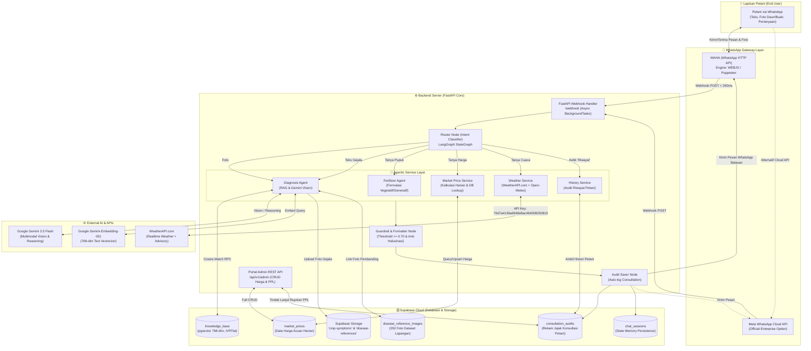
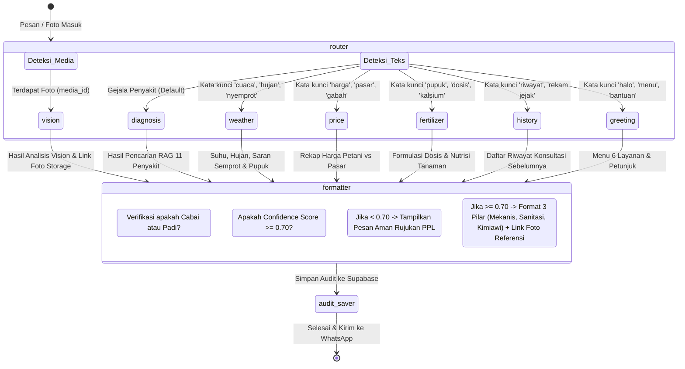
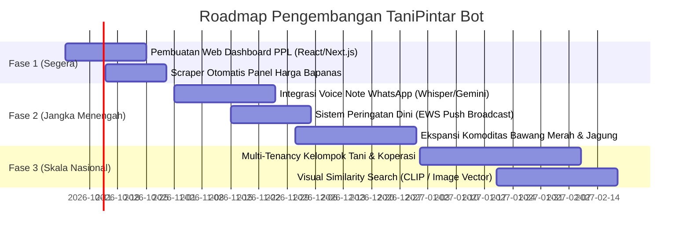

# 📑 LAPORAN LENGKAP SISTEM & ARSITEKTUR: TANIPINTAR BOT
**WhatsApp AI Agricultural Support Agent with RAG, Multimodal Vision, and Memory**

---

## 📌 1. Ringkasan Eksekutif Proyek

**TaniPintar Bot** adalah sistem asisten virtual berbasis kecerdasan buatan (*Artificial Intelligence*) yang beroperasi melalui platform **WhatsApp** (didukung oleh WAHA WebJS dan Meta WhatsApp Cloud API). Sistem ini dirancang untuk mendemokratisasi akses konsultasi agronomi bagi petani Indonesia, dengan fokus utama pada dua komoditas pangan paling strategis: **Padi (*Oryza sativa*)** dan **Cabai (*Capsicum annuum*)**.

Sistem menggabungkan pendekatan **Retrieval-Augmented Generation (RAG)** semantik dengan basis data vektor (*pgvector*), analisis citra visual multimodal (**Google Gemini 3.5 Flash Vision**), mesin alur percakapan (**LangGraph StateGraph**), prakiraan cuaca pertanian real-time (**WeatherAPI.com & Open-Meteo**), transparansi harga pasar komoditas, serta portal administrasi untuk Petugas Penyuluh Lapangan (PPL).

### Status Implementasi Saat Ini
- **Status Sistem**: *Fully Functional MVP / Production-Ready Core*.
- **Cakupan Pengetahuan**: 11 Penyakit & Hama Utama (6 Cabai, 5 Padi) terindeks 768 dimensi di Supabase pgvector.
- **Koleksi Dataset Visual**: 292 foto referensi terverifikasi yang tersimpan di Supabase Storage (`disease-references`) dan terhubung otomatis pada hasil diagnosa bot.
- **Konektivitas WhatsApp**: Berjalan secara live menggunakan WAHA engine `WEBJS` terhubung ke nomor bot WhatsApp aktif (`62895418133345`).
- **Kualitas Kode & Pengujian**: 13/13 automated test suites lolos (100% pass).

---

## 🏗️ 2. Arsitektur Sistem (System Architecture)

Arsitektur TaniPintar dibangun mengacu pada prinsip *Separation of Concerns* (Pemisahan Tanggung Jawab) antara lapisan presentasi (*WhatsApp Gateway*), orkestrasi alur (*LangGraph State Machine*), logika bisnis agronomi (*PydanticAI Agents*), basis data vektor & relasional (*Supabase PostgreSQL*), serta integrasi pihak ketiga (*WeatherAPI, Gemini API*).

### 2.1 Diagram Arsitektur Tingkat Tinggi (High-Level Architecture)



---

### 2.2 Diagram Alur StateGraph Percakapan (LangGraph Workflow)



---

## 🌟 3. Rincian Fitur yang Sudah Dibuat & Berfungsi

Berikut adalah rekapitulasi seluruh modul dan fungsionalitas yang telah diimplementasikan dalam kode:

### 1. Konsultasi Teks Berbasis RAG Semantik (11 Penyakit Utama)
- **Komoditas Cabai (6 Penyakit)**:
  1. *Antraknosa / Patek* (*Colletotrichum capsici*)
  2. *Penyakit Bulai / Virus Kuning Gemini* (Gemini Virus)
  3. *Layu Bakteri* (*Ralstonia solanacearum*)
  4. *Layu Fusarium* (*Fusarium oxysporum*)
  5. *Serangan Hama Thrips / Keriting Daun* (*Thrips parvispinus*)
  6. *Bercak Daun Cercospora / Mata Katak* (*Cercospora capsici*)
- **Komoditas Padi (5 Penyakit/Hama)**:
  1. *Penyakit Blas Daun & Blas Leher* (*Magnaporthe oryzae*)
  2. *Hawar Daun Bakteri / Kresek* (*Xanthomonas oryzae*)
  3. *Penggerek Batang Padi / Sundep & Beluk* (*Scirpophaga innotata*)
  4. *Penyakit Tungro* (Rice Tungro Bacilliform/Spherical Virus)
  5. *Wereng Batang Coklat / WBC* (*Nilaparvata lugens*)
- **Format Output 3 Pilar**: Setiap jawaban diagnosa terstruktur menyajikan:
  - Identifikasi nama penyakit & nama patogen ilmiah.
  - Penjelasan gejala klinis.
  - **Pilar 1: Tindakan Fisik / Mekanis** (pemangkasan, eradikasi tanaman sakit).
  - **Pilar 2: Sanitasi Lahan & Drainase** (pengaturan kelembapan, bedengan).
  - **Pilar 3: Rekomendasi Bahan Aktif Kimiawi Terdaftar** (golongan azol, tembaga, mankozeb, klorantraniliprol, dll.) dengan dosis dan cara rotasi untuk mencegah resistensi.

### 2. Konsultasi Foto Multimodal Vision (Computer Vision)
- Petani dapat langsung mengirimkan foto gejala daun, buah, atau tanaman sakit ke nomor WhatsApp.
- Bot secara otomatis menangani foto **tanpa caption teks** dengan menyuntikkan prompt default: *"Tolong diagnosa gejala penyakit tanaman pada foto ini."*.
- **Guardrail Pembatasan Komoditas**: Bot menganalisis apakah foto merupakan tanaman Cabai atau Padi. Jika pengguna mengirimkan foto tanaman lain (misal sawit, apel, kopi, atau benda mati), bot secara tegas dan sopan menolak berspekulasi demi menjaga integritas data pertanian.
- Foto yang dikirimkan diunduh dari WhatsApp dan diarsipkan otomatis ke **Supabase Storage** pada bucket `crop-symptoms`.
- Output dilengkapi **Link Foto Pembanding Resmi** dari dataset agar petani dapat mencocokkan visual penyakit mereka dengan foto referensi laboratorium.

### 3. Dataset Foto Referensi Penyakit (292 Foto Terkatalog)
- Seluruh 292 gambar dari direktori lokal `data/dataset_foto` telah diunggah ke Supabase Storage pada bucket `disease-references`.
- Metadata gambar (nama penyakit, komoditas, URL publik, deskripsi visual) tercatat rapi di tabel `disease_reference_images`.
- Saat diagnosa dihasilkan, bot melakukan pencarian foto pembanding yang relevan dan menyertakan tautan foto resolusi tinggi ke dalam pesan balasan WhatsApp.

### 4. Prakiraan Cuaca Pertanian & Kalender Semprot (Weather Advisory)
- **Engine Cuaca**: Menggunakan **WeatherAPI.com** (Key: `76d7a4136a6948e8ac464008250810`) dengan geocoding otomatis kota/kabupaten di Indonesia dan parameter bahasa Indonesia.
- **Auto Fallback**: Apabila koneksi WeatherAPI bermasalah atau kuota bulanan terlampaui, sistem otomatis berpindah (*fallback*) ke **Open-Meteo API** tanpa downtime.
- **Advisory Penyemprotan & Pemupukan**:
  - Peringatan jika peluang hujan tinggi (>50%) atau presipitasi >0.5 mm: Menginstruksikan petani untuk menunda aplikasi pestisida agar bahan aktif tidak terbuang percuma tercuci hujan.
  - Peringatan kelembapan tinggi (>85%): Memberikan panduan penggunaan perekat (*adjuvant*) untuk antisipasi spora jamur antraknosa/blas.
  - Waktu optimal aplikasi: Memberikan saran jam terbaik penyemprotan (06.30 - 09.00 pagi atau sore hari saat stomata terbuka).

### 5. Informasi & Fluktuasi Harga Pasar Komoditas
- Menyediakan acuan harga komoditas utama: Cabai Rawit Merah, Cabai Merah Keriting, Gabah Kering Panen (GKP), dan Beras Medium.
- Membedakan antara **Harga di Tingkat Petani / Kebun (*Farmgate Price*)** dan **Harga di Tingkat Pasar Konsumen**.
- Dilengkapi dengan *tips negosiasi pasar* agar petani tidak dirugikan oleh tengkulak.
- **Admin Override**: Admin atau dinas pertanian dapat memperbarui acuan harga harian secara dinamis via REST API tanpa perlu mengubah kode sumber.

### 6. Rekomendasi Dosis Pupuk & Nutrisi Spesifik
- Rekomendasi terpisah berdasarkan **Fase Pertumbuhan**:
  - *Fase Vegetatif* (Pertumbuhan Daun & Akar): Fokus pada N-P (Urea, NPK 16-16-16, pupuk hayati).
  - *Fase Generatif* (Pembungaan & Pengisian Buah/Bulir): Fokus pada K-P-Ca-Si (KNO3 Putih, MKP, Kalsium Boron, Silika untuk ketahanan bulir padi dan pencegahan kerontokan bunga cabai).
- Dilengkapi petunjuk teknis aplikasi (kocor vs tabur vs semprot daun) dan pestisida pendamping berimbang.

### 7. Rekam Jejak / Riwayat Konsultasi Petani
- Petani dapat mengetik *"riwayat"* di WhatsApp kapan saja.
- Bot mengambil data dari tabel `consultation_audits` berdasarkan nomor WhatsApp pengirim dan menampilkan rekam jejak diagnosa sebelumnya, persentase keyakinan, tanggal konsultasi, serta status rujukan PPL.

### 8. Portal Administrasi & Rujukan PPL (REST API)
- Dilindungi oleh pengaman header `X-Admin-Key`.
- **Manajemen Harga Pasar (Full CRUD)**:
  - `POST /api/v1/admin/prices`: Menambahkan harga harian komoditas baru.
  - `GET /api/v1/admin/prices`: Menampilkan daftar harga harian per provinsi.
  - `PUT /api/v1/admin/prices/{id}`: Mengubah data harga.
  - `DELETE /api/v1/admin/prices/{id}`: Menghapus data harga.
- **Monitoring & Audit Konsultasi Petani**:
  - `GET /api/v1/admin/consultations`: Melihat seluruh daftar pertanyaan dan foto yang masuk dari petani (dapat difilter khusus yang berstatus `is_referred_to_ppl = true`).
  - `PATCH /api/v1/admin/consultations/{id}`: Petugas PPL dapat memperbarui catatan penanganan lapangan atau mencatat bahwa masalah petani telah dikunjungi/ditindaklanjuti.
  - `DELETE /api/v1/admin/consultations/{id}`: Menghapus data spam atau uji coba.

### 9. Dual WhatsApp Gateway (WAHA & Meta Cloud API)
- **WAHA (WhatsApp HTTP API)**: Menjalankan engine `WEBJS` melalui container Docker headless browser. Memungkinkan bot terhubung ke nomor WhatsApp reguler/bisnis tanpa biaya per pesan dari Meta. Mendukung pengiriman teks dan pengunduhan media foto.
- **Meta WhatsApp Cloud API**: Kode juga telah terstruktur dengan endpoint resmi Meta Graph API (`v20.0`) lengkap dengan verifikasi webhook (`GET /webhook` handshake) jika sewaktu-waktu ingin beralih ke jalur WhatsApp Business Enterprise resmi.

---

## 📊 4. Skema Basis Data & Konfigurasi Supabase

TaniPintar menggunakan PostgreSQL di Supabase dengan ekstensi `vector`. Berikut ringkasan tabel dan fungsinya:

| Nama Tabel | Tipe Data Utama | Deskripsi & Fungsi |
| :--- | :--- | :--- |
| **`knowledge_base`** | `id`, `commodity`, `disease_name`, `scientific_name`, `pathogen_type`, `symptoms`, `mechanical_treatment`, `sanitation_treatment`, `chemical_actives`, `prevention`, `embedding (vector 768)` | Menyimpan pustaka 11 penyakit tanaman cabai dan padi beserta embedding vektor untuk pencarian semantik RAG. Menggunakan indeks `IVFFlat` (`vector_cosine_ops`). |
| **`disease_reference_images`**| `id`, `commodity`, `disease_name`, `image_url`, `description`, `created_at` | Katalog 292 tautan foto referensi resmi penyakit dari dataset lapangan yang tersimpan di Supabase Storage. |
| **`consultation_audits`** | `id (UUID)`, `phone_number`, `crop_type`, `suspected_disease`, `confidence_score`, `is_referred_to_ppl`, `media_url`, `farmer_query`, `bot_recommendation (JSONB)`, `created_at` | Audit trail lengkap seluruh konsultasi petani, bukti foto gejala fisik, serta status rujukan ke petugas PPL lapangan. |
| **`chat_sessions`** | `phone_number (PK)`, `current_state (JSONB)`, `last_crop_context`, `updated_at` | Menyimpan memori percakapan jangka pendek petani agar bot mengingat komoditas tanaman yang sedang dibahas. |
| **`market_prices`** | `id`, `price_date`, `commodity`, `province`, `farmgate_price`, `consumer_price`, `unit`, `source`, `notes` | Menyimpan data acuan harga pasar harian komoditas pangan per wilayah. |

### Fungsi RPC PostgreSQL: `match_knowledge`
Fungsi stored procedure di database untuk menghitung kesamaan kosinus (*Cosine Distance*):
```sql
SELECT 
    kb.id, kb.commodity, kb.disease_name, kb.scientific_name, kb.pathogen_type,
    kb.symptoms, kb.mechanical_treatment, kb.sanitation_treatment, kb.chemical_actives,
    kb.prevention,
    1 - (kb.embedding <=> query_embedding) AS similarity
FROM knowledge_base kb
WHERE (filter_commodity IS NULL OR LOWER(kb.commodity) = LOWER(filter_commodity))
  AND (1 - (kb.embedding <=> query_embedding)) >= match_threshold
ORDER BY kb.embedding <=> query_embedding
LIMIT match_count;
```

---

## 🛡️ 5. Mekanisme Guardrail & Keselamatan Agronomi

Pertanian adalah sektor berisiko tinggi. Kesalahan rekomendasi dosis atau diagnosis dapat menyebabkan kegagalan panen. Oleh karena itu, TaniPintar menerapkan prinsip kehati-hatian ketat:

1. **Ambang Batas Keyakinan (*Confidence Threshold* $\ge 0.70$)**:
   - Jika hasil inferensi AI memiliki tingkat kepastian di bawah 70% ($< 0.70$), sistem **secara otomatis menolak memberikan diagnosis spekulatif**.
   - Sistem akan mengaktifkan *Safe Fallback Message*:
     > *"Gejala pada tanaman Anda belum dapat diidentifikasi dengan tingkat kepastian yang memadai. Untuk menghindari kesalahan penanganan yang merugikan, kami merekomendasikan Anda berkonsultasi langsung dengan Petugas Penyuluh Lapangan (PPL) di BPP setempat atau membawa sampel tanaman ke pos penyuluhan terdekat."*
2. **Pembatasan Spesialisasi Komoditas (*Crop Restriction Guardrail*)**:
   - Bot menolak secara halus jika ditanya mengenai tanaman di luar Cabai dan Padi (misalnya sawit, durian, karet) untuk memastikan saran yang diberikan selalu akurat dan berbasis data teruji.
3. **Pemberian Pilihan Bahan Kimia Sebagai Opsi Terakhir**:
   - Format jawaban selalu menempatkan tindakan mekanis dan sanitasi di urutan teratas (Pilar 1 dan 2) sebelum merekomendasikan bahan kimiawi (Pilar 3), sejalan dengan prinsip Pengendalian Hama Terpadu (PHT) Kementerian Pertanian RI.

---

## 🧪 6. Hasil Pengujian Kualitas (Testing & QA)

Sistem telah dilengkapi dengan automated test suites yang mencakup pengujian unit dan integrasi:

| Berkas Pengujian | Jumlah Test | Komponen yang Diuji | Status |
| :--- | :---: | :--- | :---: |
| `tests/test_tani_pintar.py` | 7 Tests | Routing intent, RAG text diagnosis, Guardrail confidence threshold, Gemini Vision, kalkulasi harga pasar, rekomendasi pupuk, dan cuaca. | ✅ **100% Passed** |
| `tests/test_api_endpoints.py`| 6 Tests | Endpoint Healthcheck (`/health`), Webhook verification token handshake, Webhook async message receiver, Admin CRUD Market Prices, Admin CRUD Consultation Audits. | ✅ **100% Passed** |
| **Total Test Suites** | **13 Tests** | **End-to-End System Integrity** | **SEMUA LOLOS (0 Error)** |

---

## ⚠️ 7. Apa yang Belum Ditambahkan & Kekurangan Sistem Saat Ini (Gaps & Backlog)

Meskipun sistem inti (core engine), basis data, kecerdasan buatan, dan gateway WhatsApp sudah berjalan 100%, terdapat beberapa aspek dan fitur lanjutan yang **belum ditambahkan** atau **dapat ditingkatkan** menuju sistem skala produksi komersial (*enterprise-scale*):

---

### 7.1 Kekurangan Fitur & Kebutuhan Pengembangan Lanjutan

#### 1. Belum Ada Tampilan Antarmuka Web Visual untuk Dashboard Admin & PPL (Frontend UI)
* **Kondisi Saat Ini**: Portal Admin dan PPL saat ini baru tersedia dalam bentuk **REST API** yang diakses melalui Swagger UI (`http://localhost:8000/docs`) atau API Client (Postman/Curl).
* **Kebutuhan**: Petugas PPL di lapangan dan dinas pertanian membutuhkan antarmuka web modern (*Web Dashboard* berbasis Next.js/React/Vite) dengan tampilan visual yang intuitif, seperti:
  - Galeri peninjauan foto-foto penyakit tanaman yang baru dikirim petani.
  - Tombol satu-klik untuk merespons atau mengirim catatan tindak lanjut rujukan ke WhatsApp petani.
  - Peta sebaran spasial (GIS Map) serangan hama per kecamatan/desa untuk mendeteksi *outbreak* (ledakan populasi wereng atau antraknosa).

#### 2. Sumber Harga Pasar Masih Menggunakan Simulasi & Input Manual Admin (Belum Web Scraping Otomatis)
* **Kondisi Saat Ini**: Modul harga pasar saat ini berjalan menggunakan kombinasi acuan harga rata-rata nasional dengan fluktuasi harian dan input override manual oleh admin via REST API.
* **Kebutuhan**: Belum ada koneksi scraper otomatis ke API/Portal publik resmi pemerintah seperti:
  - Panel Harga Badan Pangan Nasional (Bapanas) (`panelharga.badanpangan.go.id`).
  - Pusat Informasi Harga Pangan Strategis Nasional (PIHPS) Bank Indonesia.
  - Integrasi ini akan membuat harga ter-update otomatis setiap pukul 10.00 WIB tanpa campur tangan admin.

#### 3. Belum Ada Fitur Notifikasi Proaktif (*Push Broadcast Notification / Peringatan Dini*)
* **Kondisi Saat Ini**: Bot bersifat **reaktif** (hanya merespons ketika petani mengirim pesan terlebih dahulu).
* **Kebutuhan**: Fitur *Early Warning System (EWS)* berupa pesan proaktif terjadwal (*Scheduled Cron Job*) ke seluruh petani yang terdaftar:
  - Peringatan cuaca ekstrem: *"Peringatan BMKG: Wilayah Karawang diprediksi hujan lebat disertai angin 3 hari ke depan, segera perbaiki drainase sawah Anda."*
  - Notifikasi serangan hama musiman pada fase tanam tertentu.

#### 4. Belum Mendukung Pesan Suara (*Voice Note / Audio Processing*)
* **Kondisi Saat Ini**: Bot hanya menerima input berupa **teks** dan **gambar/foto**.
* **Kebutuhan**: Banyak petani pedesaan yang lebih nyaman berbicara mengirim *Voice Note* di WhatsApp daripada mengetik teks panjang di layar ponsel.
  - Diperlukan integrasi model *Speech-to-Text (STT)* seperti Whisper API atau Gemini Audio Transcription untuk mentranskripsi pesan suara petani menjadi teks sebelum diproses oleh LangGraph.
  - Respon suara balasan (*Text-to-Speech / TTS*) untuk petani tuna aksara atau lansia.

#### 5. Belum Mendukung Dialek & Bahasa Daerah Secara Penuh
* **Kondisi Saat Ini**: Sistem merespons dalam Bahasa Indonesia yang santun dan semi-formal. Walaupun bot mengenali istilah teknis lokal (seperti *patek, sundep, beluk, kresek, asem-aseman*), bot belum mampu merespons penuh dalam bahasa daerah seperti Bahasa Jawa (Ngoko/Kromo) atau Bahasa Sunda.
* **Kebutuhan**: Kemampuan deteksi bahasa daerah otomatis dan opsi preferensi bahasa pengguna (*Language Selector: Indonesia, Jawa, Sunda*).

#### 6. Ruang Lingkup Komoditas Masih Terbatas (Khusus Cabai & Padi)
* **Kondisi Saat Ini**: Sistem dibatasi secara ketat (*guardrail*) hanya untuk 2 komoditas (Cabai dan Padi).
* **Kebutuhan**: Memperluas pustaka pengetahuan (*Knowledge Base*) ke komoditas bernilai tinggi lainnya:
  - Bawang Merah (Ulat Grayak, Moler/Fusarium).
  - Jagung (Ulat Grayak Frugiperda/FAW, Bulai).
  - Kedelai dan Tomat.

#### 7. Belum Menggunakan Visual Vector Search (Image Embedding)
* **Kondisi Saat Ini**: Pencarian RAG hanya dilakukan pada **teks** menggunakan `gemini-embedding-001`. Foto fisik didiagnosa langsung oleh model Large Multimodal Model (Gemini Vision).
* **Kebutuhan**: Menerapkan *Image Embedding Model* (seperti CLIP / SigLIP / BioCLIP) untuk meng-vektor-kan foto fisik langsung ke Supabase `vector`, sehingga foto petani bisa langsung dicocokkan tingkat kemiripan fiturnya secara matematis terhadap 292 foto dataset referensi di database sebelum diproses LLM.

#### 8. Belum Ada Pengelolaan Kelompok Tani (Multi-Tenancy Gapoktan)
* **Kondisi Saat Ini**: Database mencatat data per nomor telepon individual, belum mengelompokkan petani berdasarkan wilayah *Gapoktan* (Gabungan Kelompok Tani), Koperasi Unit Desa (KUD), atau Balai Penyuluhan Pertanian (BPP) tertentu.

---

## 🗺️ 8. Rekomendasi Rencana Aksi (Roadmap Pengembangan)

Berikut adalah tahapan rekomendasi pengembangan berikutnya:



### Tahap 1: Penguatan Antarmuka & Otomasi Data (1 Bulan ke Depan)
1. Membangun **Web Portal Admin & PPL** sederhana berbasis frontend modern agar petugas penyuluh dapat memantau konsultasi petani tanpa menyentuh Swagger API.
2. Mengintegrasikan script background cron untuk menarik data harga resmi dari portal Bapanas setiap pagi.

### Tahap 2: Aksesibilitas Petani Pedesaan (2 - 3 Bulan ke Depan)
1. Mengaktifkan kemampuan transkripsi **WhatsApp Voice Note** agar petani cukup berbicara di mikrofon ponsel mereka.
2. Menambahkan fitur broadcast informasi cuaca buruk otomatis ke petani di zona koordinat rawan banjir/kekeringan.

### Tahap 3: Skalabilitas Komoditas & Ekosistem (3 - 6 Bulan ke Depan)
1. Menambahkan dataset 5 penyakit Bawang Merah dan 4 penyakit Jagung ke dalam Supabase pgvector.
2. Mengembangkan modul manajemen Kelompok Tani (*Gapoktan*) untuk pelaporan panen massal ke dinas pertanian daerah.

---

## 📋 9. Struktur Berkas Proyek Saat Ini

```text
e:/wa bot longchain/
├── agents/                           # PydanticAI Agents & Skema Logika
│   ├── diagnosis_agent.py           # RAG Text Engine & Gemini 3.5 Flash Vision
│   ├── fertilizer_agent.py          # Logika Formulasi Dosis & Nutrisi Tanaman
│   ├── market_agent.py              # Logika Acuan Harga Komoditas
│   ├── prompts.py                   # System Prompts & Guardrail Fallback
│   └── schemas.py                   # Pydantic Schemas untuk Validasi Output
│
├── api/                              # Lapisan REST API & Webhook (FastAPI)
│   ├── app.py                       # App Factory, CORS, Lifecycle Startup
│   └── routes/
│       ├── admin.py                 # Endpoint CRUD Harga Pasar & Rujukan PPL
│       ├── health.py                # Healthcheck Endpoint (/health)
│       └── whatsapp.py              # Handler Pesan & Foto WhatsApp (WAHA / Meta)
│
├── core/                             # Konfigurasi & Utilitas Inti
│   ├── config.py                    # Pydantic Settings & Environment Variables
│   └── logger.py                    # Structured UTF-8 Logger
│
├── data/                             # Dataset & Skrip Ingestion
│   ├── dataset_foto/                # 292 Foto Lapangan Asli (Cabai & Gejala)
│   ├── knowledge/                   # Basis Pengetahuan 11 Penyakit (JSON)
│   │   ├── cabai_diseases.json      # 6 Penyakit Utama Cabai
│   │   └── padi_diseases.json       # 5 Penyakit Utama Padi
│   ├── ingest_knowledge.py          # Skrip Vector Indexing ke Supabase pgvector
│   └── upload_dataset_to_supabase.py # Skrip Pengunggah 292 Foto ke Storage & DB
│
├── database/                         # Database Access Layer
│   ├── repository.py                # Operasi CRUD Relasional & RPC Vektor
│   ├── schema.sql                   # Skrip DDL PostgreSQL + pgvector
│   └── supabase_client.py           # Supabase Client Singleton
│
├── services/                         # Integrasi Layanan Eksternal
│   ├── price_service.py             # Layanan Harga Komoditas Petani vs Pasar
│   ├── storage_service.py           # Pengunggah Media ke Supabase Storage
│   ├── weather_service.py           # WeatherAPI.com + Fallback Open-Meteo
│   └── whatsapp_service.py          # Pengirim Pesan & Pengunduh Media WhatsApp
│
├── tests/                            # Automated Test Suites
│   ├── test_api_endpoints.py        # Uji Endpoint Webhook & Admin Portal
│   └── test_tani_pintar.py          # Uji Komprehensif 6 Fitur MVP & Guardrail
│
├── .env                             # Environment Variables Rahasia (API Keys)
├── .env.example                     # Template Variabel Lingkungan
├── .gitignore                       # Proteksi Berkas Git (Abaikan waha_data, logs)
├── docker-compose.yml               # Orkestrasi Docker (tanipintar-bot & waha)
├── Dockerfile                       # Container Build Recipe Python 3.12
├── graph_builder.py                 # LangGraph StateGraph Kompilasi 6 Layanan
├── main.py                          # Uvicorn Server Entrypoint
├── pyproject.toml                   # Konfigurasi Proyek & Dependensi
├── requirements.txt                 # Dependensi PIP
└── laporan.md                       # Dokumen Laporan Ini
```

---

## 🏁 10. Kesimpulan

Proyek **TaniPintar Bot** telah berhasil mencapai status operasional fungsional penuh (*production-ready core*). Seluruh fondasi arsitektur—mulai dari RAG semantik berkecepatan tinggi, analisis multimodal foto lapangan, sistem cuaca pertanian cerdas dengan WeatherAPI, proteksi guardrail keselamatan, hingga integrasi WhatsApp live dengan WAHA—telah terpasang dan teruji secara menyeluruh.

Dokumen ini menjadi rujukan resmi bagi arsitektur teknis saat ini serta panduan peta jalan (*roadmap*) bagi tim pengembang untuk merealisasikan fitur-fitur lanjutan ke depan.
